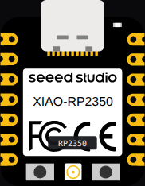
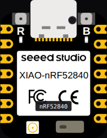
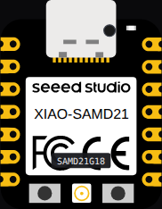
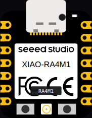
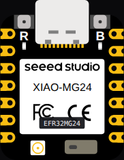
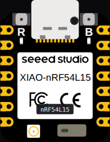
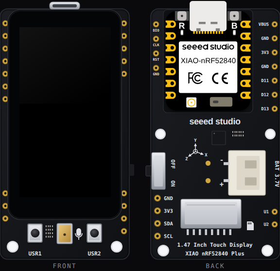

Pro boards are the catalog's premium tier: branded hardware with rich
built-in peripherals, emulated deeply enough to boot their **factory
firmware**. They are part of the hosted catalog on velxio.dev.

:::note[Which plan do they need?]
**Only the UNIHIKER M10 requires a paid plan.** Every other board on this
page — M5Stack, Pimoroni, XIAO and the ESP32-C6 DevKit — **runs on the
free plan**. The paid-only boards are exactly the STM32 family and the
Raspberry Pi Linux family (which is where the UNIHIKER belongs). See
[plans](/docs/getting-started/plans/).
:::

## M5Stack

_Free plan._

### M5 Cardputer ADV

The ESP32-S3 pocket computer with keyboard and TFT. Boots the real M5
launcher firmware; type on the on-screen keyboard, run apps, use the
speaker.

Get the real board on the [M5Stack store](https://shop.m5stack.com/products/m5stack-cardputer-adv-version-esp32-s3?ref=ehphcrsn&utm_source=velxio&utm_medium=docs-family&utm_content=cardputer-adv).

### M5Stack Core

The classic stackable ESP32 with 320x240 TFT and three buttons.

Get the real board on the [M5Stack store](https://shop.m5stack.com/products/esp32-basic-core-lot-development-kit-v2-7?ref=ehphcrsn&utm_source=velxio&utm_medium=docs-family&utm_content=m5stack-core).

*Store links on this page are affiliate links: Velxio earns a small commission at no extra cost to you.*

## Pimoroni

_Free plan._

### Badger 2350

The RP2350 e-paper badge. It boots the complete **BadgeOS factory
firmware**: navigate the launcher with the A/B/C/UP/DOWN buttons, open
the clock, badge and gallery apps, and watch the e-paper refresh the way
e-paper really does.

### Galactic Unicorn

The 53x11 RGB LED matrix (583 pixels) driven by an on-board Pico 2 W
(RP2350), with the A/B/C/D and volume / brightness buttons.

### Pico Plus 2 W

Pimoroni's RP2350B board in the standard Pico footprint (GP0..GP28 plus
power), so any Pico wiring drops straight onto it. GPIO, UART, USB serial,
I2C and SPI run; the CYW43 WiFi coprocessor and PSRAM are not emulated.

## Seeed Studio XIAO

_Free plan._

### XIAO ESP32S3 Sense

The S3 with the camera module, PDM microphone and microSD.

### XIAO ESP32C6

WiFi 6 capable RISC-V C6 in the XIAO footprint.

### XIAO RP2040

The RP2040 XIAO with its NeoPixel.

### XIAO RP2350

The RP2350 XIAO — dual core at 150 MHz, Arduino C++ or MicroPython.

### XIAO nRF52840 Sense

Nordic's nRF52840 with a 6-axis IMU: tilt it from the **Sensors** button on
the canvas toolbar. Bluetooth is not emulated.

### Seeeduino XIAO (SAMD21)

The original XIAO, with a real DAC on A0.

### XIAO RA4M1

The UNO R4 Minima's MCU in the XIAO footprint, 12-bit DAC included.

### XIAO MG24 Sense

Silicon Labs' EFR32MG24 with a 6-axis IMU. The radio is not emulated.

### XIAO nRF54L15 Sense

Nordic's nRF54L15 with a 6-axis IMU. The radio is not emulated.

### XIAO IPS Display boards

Three carrier boards with a pre-soldered XIAO nRF52840 Plus, drawn front and
back: the [0.96"](/docs/boards/reference/xiao-096-display/) (80 x 160, two
buttons), the [1.14"](/docs/boards/reference/xiao-114-display/) (135 x 240,
three buttons, Grove I2C) and the
[1.47" Touch](/docs/boards/reference/xiao-147-touch-display/) (172 x 320,
capacitive touch, microSD). The glass is the emulated panel controller's
memory; the buttons, the IMU, the touch layer and the card all work, and
Seeed's own demo sketches run unchanged.

## Espressif ESP32-C6

_Free plan._

The **ESP32-C6 DevKit** — the RISC-V WiFi-6 chip, with the same language
trio (Arduino / MicroPython / ESP-IDF) as the rest of the ESP32 family.

## DFRobot UNIHIKER M10

_Paid plan required._

A Linux single-board computer with built-in touchscreen — documented with
the [Raspberry Pi family](/docs/boards/raspberry-pi/), since it shares the
full-Linux workflow. Like the rest of that family, it is the one board on
this page that **needs a paid plan** to run.

Get the real board on the [DFRobot store](https://www.dfrobot.com/product-2691.html?tracking=rzqVux&utm_source=velxio&utm_medium=docs-family&utm_content=unihiker-m10).

*This store link is an affiliate link: Velxio earns a small commission at no extra cost to you.*

---

Pro boards appear in the [component picker](/docs/circuit-editor/placing-components/)
with a **PRO badge**; the [starter templates](/docs/getting-started/projects/)
include ready-to-run projects for each.

## Board art and pinouts

Each board's canvas art and full pin map, generated from the simulator:

[Badger 2350](/docs/boards/reference/badger-2350/) ·
[Galactic Unicorn](/docs/boards/reference/galactic-unicorn/) ·
[Pico Plus 2 W](/docs/boards/reference/pimoroni-pico-plus-2w/) ·
[M5 Cardputer ADV](/docs/boards/reference/cardputer-adv/) ·
[M5Stack Core](/docs/boards/reference/m5stack-core/) ·
[ESP32-C6 DevKit](/docs/boards/reference/esp32-c6/) ·
[XIAO ESP32S3 Sense](/docs/boards/reference/xiao-esp32s3-sense/) ·
[XIAO ESP32C6](/docs/boards/reference/xiao-esp32c6/) ·
[XIAO RP2040](/docs/boards/reference/xiao-rp2040/) ·
[XIAO RP2350](/docs/boards/reference/xiao-rp2350/) ·
[XIAO nRF52840 Sense](/docs/boards/reference/xiao-nrf52840-sense/) ·
[Seeeduino XIAO (SAMD21)](/docs/boards/reference/xiao-samd21/) ·
[XIAO RA4M1](/docs/boards/reference/xiao-ra4m1/) ·
[XIAO MG24 Sense](/docs/boards/reference/xiao-mg24-sense/) ·
[XIAO nRF54L15 Sense](/docs/boards/reference/xiao-nrf54l15-sense/) ·
[XIAO 0.96" IPS Display](/docs/boards/reference/xiao-096-display/) ·
[XIAO 1.14" IPS Display](/docs/boards/reference/xiao-114-display/) ·
[XIAO 1.47" IPS Touch Display](/docs/boards/reference/xiao-147-touch-display/) ·
[UNIHIKER M10](/docs/boards/reference/unihiker-m10/)
