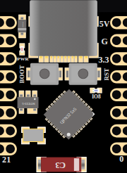

<!-- Generated by scripts/gen-boards.mjs — do not edit by hand. -->

The board as it appears on the Velxio canvas, with its full pin map
read live from the simulator (regenerated by `scripts/gen-boards.mjs`,
so it always matches what you can wire).

**Family:** [ESP32-S3 and ESP32-C3](/docs/boards/esp32-s3-c3/) ·
**Languages:** Arduino C++, MicroPython, ESP-IDF

## About this board

The postage-stamp C3 board that turns up in every parts-bin project — same
single-core RISC-V ESP32-C3 as the [DevKit](/docs/boards/reference/esp32-c3/),
sixteen pins, and almost no board around the chip.

Its inputs are driven by the analog engine like the rest of the catalog, so a
switch or divider wired to a GPIO reads the voltage the circuit actually
produces rather than an idealised level — see
[analog simulation](/docs/instruments/analog-simulation/).

## Start here

No separate starter: open
[New ESP32-C3 project](https://velxio.dev/example/c3-blink) and swap the board,
or place it from **Add Component**.

## Pins (16)

<ul class="pin-grid">
<li>5</li>
<li>6</li>
<li>7</li>
<li>8</li>
<li>9</li>
<li>10</li>
<li>RX</li>
<li>TX</li>
<li>5V</li>
<li>GND</li>
<li>3V3</li>
<li>4</li>
<li>3</li>
<li>2</li>
<li>1</li>
<li>0</li>
</ul>

Every pin above is clickable on the canvas — click one to start a
[wire](/docs/circuit-editor/wiring/). Board-level behavior, quirks and
example links live on the [family page](/docs/boards/esp32-s3-c3/).
