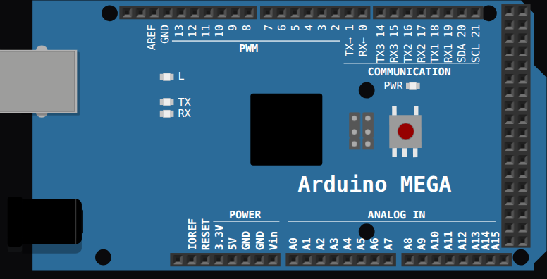

<!-- Generated by scripts/gen-boards.mjs — do not edit by hand. -->

The board as it appears on the Velxio canvas, with its full pin map
read live from the simulator (regenerated by `scripts/gen-boards.mjs`,
so it always matches what you can wire).

**Family:** [Arduino & AVR](/docs/boards/arduino/) ·
**Languages:** Arduino C++

## Pins (85)

<ul class="pin-grid has-signals">
<li>SCLi2c</li>
<li>SDAi2c</li>
<li>AREF</li>
<li>GND.1power</li>
<li>13pwm</li>
<li>12pwm</li>
<li>11pwm</li>
<li>10pwm</li>
<li>9pwm</li>
<li>8pwm</li>
<li>7pwm</li>
<li>6pwm</li>
<li>5pwm</li>
<li>4pwm</li>
<li>3pwm</li>
<li>2pwm</li>
<li>1usart</li>
<li>0usart</li>
<li>14usart</li>
<li>15usart</li>
<li>16usart</li>
<li>17usart</li>
<li>18usart</li>
<li>19usart</li>
<li>20i2c</li>
<li>21i2c</li>
<li>5V.1power</li>
<li>5V.2power</li>
<li>22</li>
<li>23</li>
<li>24</li>
<li>25</li>
<li>26</li>
<li>27</li>
<li>28</li>
<li>29</li>
<li>30</li>
<li>31</li>
<li>32</li>
<li>33</li>
<li>34</li>
<li>35</li>
<li>36</li>
<li>37</li>
<li>38</li>
<li>39</li>
<li>40</li>
<li>41</li>
<li>42</li>
<li>43</li>
<li>44pwm</li>
<li>45pwm</li>
<li>46pwm</li>
<li>47</li>
<li>48</li>
<li>49</li>
<li>50spi</li>
<li>51spi</li>
<li>52spi</li>
<li>53</li>
<li>GND.4power</li>
<li>GND.5power</li>
<li>IOREF</li>
<li>RESET</li>
<li>3.3Vpower</li>
<li>5Vpower</li>
<li>GND.2power</li>
<li>GND.3power</li>
<li>VINpower</li>
<li>A0analog</li>
<li>A1analog</li>
<li>A2analog</li>
<li>A3analog</li>
<li>A4analog</li>
<li>A5analog</li>
<li>A6analog</li>
<li>A7analog</li>
<li>A8analog</li>
<li>A9analog</li>
<li>A10analog</li>
<li>A11analog</li>
<li>A12analog</li>
<li>A13analog</li>
<li>A14analog</li>
<li>A15analog</li>
</ul>

Every pin above is clickable on the canvas — click one to start a
[wire](/docs/circuit-editor/wiring/). Board-level behavior, quirks and
example links live on the [family page](/docs/boards/arduino/).
