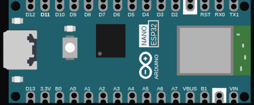

<!-- Generated by scripts/gen-boards.mjs — do not edit by hand. -->

The board as it appears on the Velxio canvas, with its full pin map
read live from the simulator (regenerated by `scripts/gen-boards.mjs`,
so it always matches what you can wire).

**Family:** [ESP32-S3 and ESP32-C3](/docs/boards/esp32-s3-c3/) ·
**Languages:** Arduino C++, MicroPython, ESP-IDF

## Pins (30)

| Pin       | Signals |
| --------- | ------- |
| **D12**   | —       |
| **D11**   | —       |
| **D10**   | —       |
| **D9**    | —       |
| **D8**    | —       |
| **D7**    | —       |
| **D6**    | —       |
| **D5**    | —       |
| **D4**    | —       |
| **D3**    | —       |
| **D2**    | —       |
| **GND.1** | —       |
| **RST**   | —       |
| **RX0**   | —       |
| **TX1**   | —       |
| **D13**   | —       |
| **3V3**   | —       |
| **B0**    | —       |
| **A0**    | —       |
| **A1**    | —       |
| **A2**    | —       |
| **A3**    | —       |
| **A4**    | —       |
| **A5**    | —       |
| **A6**    | —       |
| **A7**    | —       |
| **VBUS**  | —       |
| **B1**    | —       |
| **GND.2** | —       |
| **VIN**   | —       |

Every pin above is clickable on the canvas — click one to start a
[wire](/docs/circuit-editor/wiring/). Board-level behavior, quirks and
example links live on the [family page](/docs/boards/esp32-s3-c3/).
