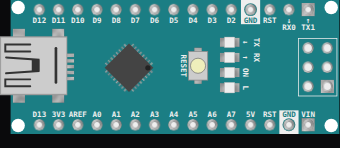

<!-- Generated by scripts/gen-boards.mjs — do not edit by hand. -->

The board as it appears on the Velxio canvas, with its full pin map
read live from the simulator (regenerated by `scripts/gen-boards.mjs`,
so it always matches what you can wire).

**Family:** [Arduino & AVR](/docs/boards/arduino/) ·
**Languages:** Arduino C++

## Pins (36)

| Pin         | Signals     |
| ----------- | ----------- |
| **12**      | spi         |
| **11**      | spi, pwm    |
| **10**      | spi, pwm    |
| **9**       | pwm         |
| **8**       | —           |
| **7**       | —           |
| **6**       | pwm         |
| **5**       | pwm         |
| **4**       | —           |
| **3**       | pwm         |
| **2**       | —           |
| **GND.2**   | power       |
| **RESET.2** | —           |
| **0**       | usart       |
| **1**       | usart       |
| **13**      | spi         |
| **3.3V**    | power       |
| **AREF**    | —           |
| **A0**      | analog      |
| **A1**      | analog      |
| **A2**      | analog      |
| **A3**      | analog      |
| **A4**      | analog, i2c |
| **A5**      | analog, i2c |
| **A6**      | analog      |
| **A7**      | analog      |
| **5V**      | power       |
| **RESET**   | —           |
| **GND.1**   | power       |
| **VIN**     | power       |
| **12.2**    | spi         |
| **5V.2**    | power       |
| **13.2**    | spi         |
| **11.2**    | spi, pwm    |
| **RESET.3** | —           |
| **GND.3**   | power       |

Every pin above is clickable on the canvas — click one to start a
[wire](/docs/circuit-editor/wiring/). Board-level behavior, quirks and
example links live on the [family page](/docs/boards/arduino/).
