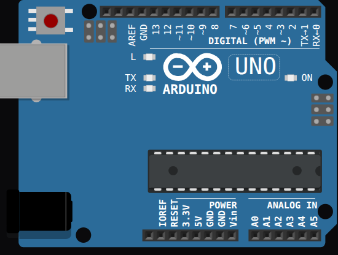

<!-- Generated by scripts/gen-boards.mjs — do not edit by hand. -->

The board as it appears on the Velxio canvas, with its full pin map
read live from the simulator (regenerated by `scripts/gen-boards.mjs`,
so it always matches what you can wire).

**Family:** [Arduino & AVR](/docs/boards/arduino/) ·
**Languages:** Arduino C++

## About this board

The ATmega328P at 16 MHz with 32 KB of flash — the default board for most of
the catalog's circuit examples, and the one the wiring and analog pages use.
Fourteen digital pins and six analog inputs, with the on-board LED on pin 13.

The UNO is also one of only three boards whose pin map carries **signal
names**: the cards below tell you which pins are PWM, which speak I2C
(`A4`/`A5`) or SPI (`10` through `13`), and which belong to the USART. That
comes from the board's own pin metadata, not from a table maintained here.

## Start here

[New Arduino UNO project](https://velxio.dev/example/blink-led) opens the
editor with this board and a working blink sketch — edit the code, wire
components and press Run. The [first project tutorial](/docs/getting-started/first-project/)
walks the same loop end to end.

## Pins (31)

<ul class="pin-grid has-signals">
<li>A5.2analog, i2c</li>
<li>A4.2analog, i2c</li>
<li>AREF</li>
<li>GND.1power</li>
<li>13spi</li>
<li>12spi</li>
<li>11spi, pwm</li>
<li>10spi, pwm</li>
<li>9pwm</li>
<li>8</li>
<li>7</li>
<li>6pwm</li>
<li>5pwm</li>
<li>4</li>
<li>3pwm</li>
<li>2</li>
<li>1usart</li>
<li>0usart</li>
<li>IOREF</li>
<li>RESET</li>
<li>3.3Vpower</li>
<li>5Vpower</li>
<li>GND.2power</li>
<li>GND.3power</li>
<li>VINpower</li>
<li>A0analog</li>
<li>A1analog</li>
<li>A2analog</li>
<li>A3analog</li>
<li>A4analog, i2c</li>
<li>A5analog, i2c</li>
</ul>

Every pin above is clickable on the canvas — click one to start a
[wire](/docs/circuit-editor/wiring/). Board-level behavior, quirks and
example links live on the [family page](/docs/boards/arduino/).
