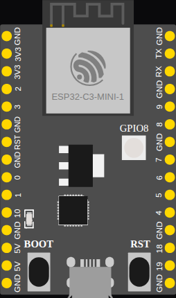

<!-- Generated by scripts/gen-boards.mjs — do not edit by hand. -->

The board as it appears on the Velxio canvas, with its full pin map
read live from the simulator (regenerated by `scripts/gen-boards.mjs`,
so it always matches what you can wire).

**Family:** [ESP32-S3 and ESP32-C3](/docs/boards/esp32-s3-c3/) ·
**Languages:** Arduino C++, MicroPython, ESP-IDF

## Pins (30)

| Pin        | Signals |
| ---------- | ------- |
| **GND.1**  | —       |
| **3V3.1**  | —       |
| **3V3.2**  | —       |
| **2**      | —       |
| **3**      | —       |
| **GND.2**  | —       |
| **RST**    | —       |
| **GND.3**  | —       |
| **0**      | —       |
| **1**      | —       |
| **10**     | —       |
| **GND.4**  | —       |
| **5V.1**   | —       |
| **5V.2**   | —       |
| **GND.5**  | —       |
| **GND.6**  | —       |
| **19**     | —       |
| **18**     | —       |
| **GND.7**  | —       |
| **4**      | —       |
| **5**      | —       |
| **6**      | —       |
| **7**      | —       |
| **GND.8**  | —       |
| **8**      | —       |
| **9**      | —       |
| **GND.9**  | —       |
| **RX**     | —       |
| **TX**     | —       |
| **GND.10** | —       |

Every pin above is clickable on the canvas — click one to start a
[wire](/docs/circuit-editor/wiring/). Board-level behavior, quirks and
example links live on the [family page](/docs/boards/esp32-s3-c3/).
