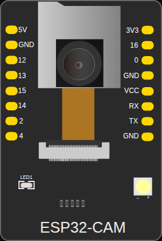

<!-- Generated by scripts/gen-boards.mjs — do not edit by hand. -->

The board as it appears on the Velxio canvas, with its full pin map
read live from the simulator (regenerated by `scripts/gen-boards.mjs`,
so it always matches what you can wire).

**Family:** [ESP32 (classic)](/docs/boards/esp32/) ·
**Languages:** Arduino C++, MicroPython, ESP-IDF

## Pins (16)

| Pin       | Signals |
| --------- | ------- |
| **5V.1**  | —       |
| **GND.1** | —       |
| **12**    | —       |
| **13**    | —       |
| **15**    | —       |
| **14**    | —       |
| **2**     | —       |
| **4**     | —       |
| **3V3**   | —       |
| **16**    | —       |
| **0**     | —       |
| **GND.2** | —       |
| **VCC**   | —       |
| **RX**    | —       |
| **TX**    | —       |
| **GND.3** | —       |

Every pin above is clickable on the canvas — click one to start a
[wire](/docs/circuit-editor/wiring/). Board-level behavior, quirks and
example links live on the [family page](/docs/boards/esp32/).
