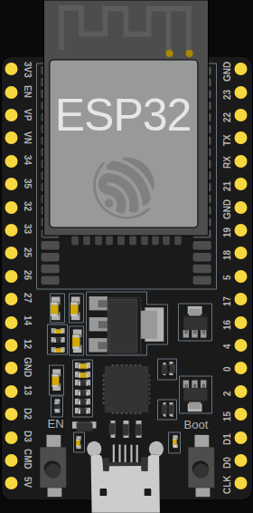

<!-- Generated by scripts/gen-boards.mjs — do not edit by hand. -->

The board as it appears on the Velxio canvas, with its full pin map
read live from the simulator (regenerated by `scripts/gen-boards.mjs`,
so it always matches what you can wire).

**Family:** [ESP32 (classic)](/docs/boards/esp32/) ·
**Languages:** Arduino C++, MicroPython, ESP-IDF

## Pins (38)

<ul class="pin-grid">
<li>3V3</li>
<li>EN</li>
<li>VP</li>
<li>VN</li>
<li>34</li>
<li>35</li>
<li>32</li>
<li>33</li>
<li>25</li>
<li>26</li>
<li>27</li>
<li>14</li>
<li>12</li>
<li>GND.1</li>
<li>13</li>
<li>D2</li>
<li>D3</li>
<li>CMD</li>
<li>5V</li>
<li>GND.2</li>
<li>23</li>
<li>22</li>
<li>TX</li>
<li>RX</li>
<li>21</li>
<li>GND.3</li>
<li>19</li>
<li>18</li>
<li>5</li>
<li>17</li>
<li>16</li>
<li>4</li>
<li>0</li>
<li>2</li>
<li>15</li>
<li>D1</li>
<li>D0</li>
<li>CLK</li>
</ul>

Every pin above is clickable on the canvas — click one to start a
[wire](/docs/circuit-editor/wiring/). Board-level behavior, quirks and
example links live on the [family page](/docs/boards/esp32/).
