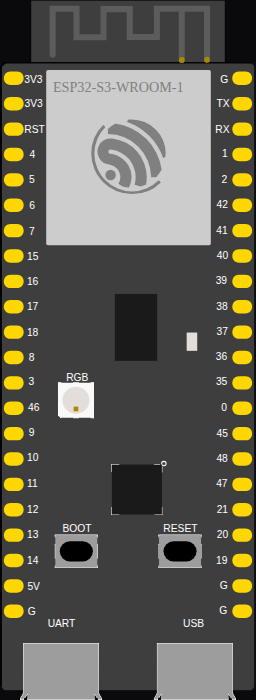

<!-- Generated by scripts/gen-boards.mjs — do not edit by hand. -->

The board as it appears on the Velxio canvas, with its full pin map
read live from the simulator (regenerated by `scripts/gen-boards.mjs`,
so it always matches what you can wire).

**Family:** [ESP32-S3 and ESP32-C3](/docs/boards/esp32-s3-c3/) ·
**Languages:** Arduino C++, MicroPython, ESP-IDF

## Pins (44)

| Pin       | Signals |
| --------- | ------- |
| **3V3.1** | —       |
| **3V3.2** | —       |
| **RST**   | —       |
| **4**     | —       |
| **5**     | —       |
| **6**     | —       |
| **7**     | —       |
| **15**    | —       |
| **16**    | —       |
| **17**    | —       |
| **18**    | —       |
| **8**     | —       |
| **3**     | —       |
| **46**    | —       |
| **9**     | —       |
| **10**    | —       |
| **11**    | —       |
| **12**    | —       |
| **13**    | —       |
| **14**    | —       |
| **5V**    | —       |
| **GND.1** | —       |
| **GND.2** | —       |
| **TX**    | —       |
| **RX**    | —       |
| **1**     | —       |
| **2**     | —       |
| **42**    | —       |
| **41**    | —       |
| **40**    | —       |
| **39**    | —       |
| **38**    | —       |
| **37**    | —       |
| **36**    | —       |
| **35**    | —       |
| **0**     | —       |
| **45**    | —       |
| **48**    | —       |
| **47**    | —       |
| **21**    | —       |
| **20**    | —       |
| **19**    | —       |
| **GND.3** | —       |
| **GND.4** | —       |

Every pin above is clickable on the canvas — click one to start a
[wire](/docs/circuit-editor/wiring/). Board-level behavior, quirks and
example links live on the [family page](/docs/boards/esp32-s3-c3/).
