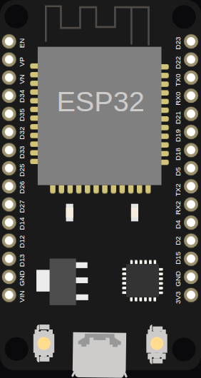

<!-- Generated by scripts/gen-boards.mjs — do not edit by hand. -->

The board as it appears on the Velxio canvas, with its full pin map
read live from the simulator (regenerated by `scripts/gen-boards.mjs`,
so it always matches what you can wire).

**Family:** [ESP32 (classic)](/docs/boards/esp32/) ·
**Languages:** Arduino C++, MicroPython, ESP-IDF

## About this board

The standard 30-pin ESP32 DevKit V1 — the workhorse of the catalog and the
board most ESP32 examples target. Dual-core Xtensa, **WiFi and Bluetooth both
live in the simulator**, and the built-in LED sits on `GPIO2`.

Everything the family page describes applies here first: real WiFi out to the
internet, the LEDC PWM peripheral, ADC, I2C, SPI, UART, and a boot that prints
the actual ROM log to the serial monitor.

## Start here

[New ESP32 project](https://velxio.dev/example/esp32-blink-led) opens the
editor with this board and a working blink sketch. It is also the board used
throughout the [first project tutorial](/docs/getting-started/first-project/),
the [oscilloscope](/docs/instruments/oscilloscope/) page and the
[WiFi guide](/docs/wifi-iot/esp32-wifi/).

## Pins (32)

<ul class="pin-grid">
<li>EN</li>
<li>VN</li>
<li>VP</li>
<li>34</li>
<li>35</li>
<li>32</li>
<li>33</li>
<li>25</li>
<li>26</li>
<li>27</li>
<li>14</li>
<li>12</li>
<li>13</li>
<li>GND</li>
<li>VIN</li>
<li>3V3</li>
<li>GND2</li>
<li>15</li>
<li>2</li>
<li>4</li>
<li>RX2</li>
<li>16</li>
<li>TX2</li>
<li>17</li>
<li>5</li>
<li>18</li>
<li>19</li>
<li>21</li>
<li>RX0</li>
<li>TX0</li>
<li>22</li>
<li>23</li>
</ul>

Every pin above is clickable on the canvas — click one to start a
[wire](/docs/circuit-editor/wiring/). Board-level behavior, quirks and
example links live on the [family page](/docs/boards/esp32/).
