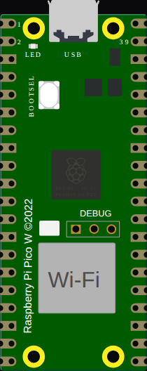

<!-- Generated by scripts/gen-boards.mjs — do not edit by hand. -->

The board as it appears on the Velxio canvas, with its full pin map
read live from the simulator (regenerated by `scripts/gen-boards.mjs`,
so it always matches what you can wire).

**Family:** [Raspberry Pi Pico & Pico W](/docs/boards/pico/) ·
**Languages:** Arduino C++, MicroPython

## Pins (44)

<ul class="pin-grid">
<li>GP0</li>
<li>GP1</li>
<li>GND.1</li>
<li>GP2</li>
<li>GP3</li>
<li>GP4</li>
<li>GP5</li>
<li>GND.2</li>
<li>GP6</li>
<li>GP7</li>
<li>GP8</li>
<li>GP9</li>
<li>GND.3</li>
<li>GP10</li>
<li>GP11</li>
<li>GP12</li>
<li>GP13</li>
<li>GND.4</li>
<li>GP14</li>
<li>GP15</li>
<li>GP16</li>
<li>GP17</li>
<li>GND.5</li>
<li>GP18</li>
<li>GP19</li>
<li>GP20</li>
<li>GP21</li>
<li>GND.6</li>
<li>GP22</li>
<li>RUN</li>
<li>GP26</li>
<li>A0</li>
<li>GP27</li>
<li>A1</li>
<li>GND.7</li>
<li>GP28</li>
<li>A2</li>
<li>ADC_VREF</li>
<li>3V3</li>
<li>3V3_EN</li>
<li>GND.8</li>
<li>VSYS</li>
<li>VBUS</li>
<li>GP25</li>
</ul>

Every pin above is clickable on the canvas — click one to start a
[wire](/docs/circuit-editor/wiring/). Board-level behavior, quirks and
example links live on the [family page](/docs/boards/pico/).
