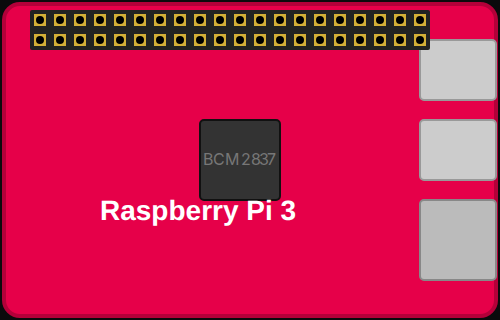

<!-- Generated by scripts/gen-boards.mjs — do not edit by hand. -->

The board as it appears on the Velxio canvas, with its full pin map
read live from the simulator (regenerated by `scripts/gen-boards.mjs`,
so it always matches what you can wire).

**Family:** [Raspberry Pi (Linux)](/docs/boards/raspberry-pi/) ·
**Languages:** Python on Linux

## Pins (40)

| Pin    | Signals |
| ------ | ------- |
| **1**  | —       |
| **2**  | —       |
| **3**  | —       |
| **4**  | —       |
| **5**  | —       |
| **6**  | —       |
| **7**  | —       |
| **8**  | —       |
| **9**  | —       |
| **10** | —       |
| **11** | —       |
| **12** | —       |
| **13** | —       |
| **14** | —       |
| **15** | —       |
| **16** | —       |
| **17** | —       |
| **18** | —       |
| **19** | —       |
| **20** | —       |
| **21** | —       |
| **22** | —       |
| **23** | —       |
| **24** | —       |
| **25** | —       |
| **26** | —       |
| **27** | —       |
| **28** | —       |
| **29** | —       |
| **30** | —       |
| **31** | —       |
| **32** | —       |
| **33** | —       |
| **34** | —       |
| **35** | —       |
| **36** | —       |
| **37** | —       |
| **38** | —       |
| **39** | —       |
| **40** | —       |

Every pin above is clickable on the canvas — click one to start a
[wire](/docs/circuit-editor/wiring/). Board-level behavior, quirks and
example links live on the [family page](/docs/boards/raspberry-pi/).
