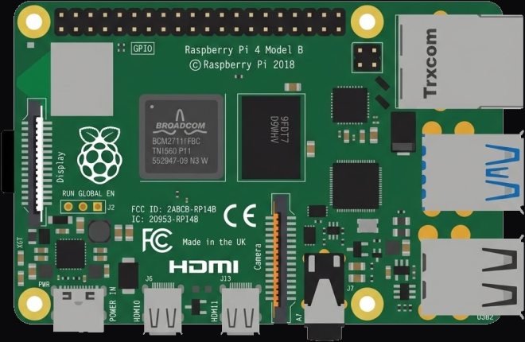

<!-- Generated by scripts/gen-boards.mjs — do not edit by hand. -->

The board as it appears on the Velxio canvas, with its full pin map
read live from the simulator (regenerated by `scripts/gen-boards.mjs`,
so it always matches what you can wire).

**Family:** [Raspberry Pi (Linux)](/docs/boards/raspberry-pi/) ·
**Languages:** Python on Linux

## Pins (40)

<ul class="pin-grid">
<li>3V3</li>
<li>5V</li>
<li>GPIO2</li>
<li>5V</li>
<li>GPIO3</li>
<li>GND</li>
<li>GPIO4</li>
<li>GPIO14</li>
<li>GND</li>
<li>GPIO15</li>
<li>GPIO17</li>
<li>GPIO18</li>
<li>GPIO27</li>
<li>GND</li>
<li>GPIO22</li>
<li>GPIO23</li>
<li>3V3</li>
<li>GPIO24</li>
<li>GPIO10</li>
<li>GND</li>
<li>GPIO9</li>
<li>GPIO25</li>
<li>GPIO11</li>
<li>GPIO8</li>
<li>GND</li>
<li>GPIO7</li>
<li>ID_SD</li>
<li>ID_SC</li>
<li>GPIO5</li>
<li>GND</li>
<li>GPIO6</li>
<li>GPIO12</li>
<li>GPIO13</li>
<li>GND</li>
<li>GPIO19</li>
<li>GPIO16</li>
<li>GPIO26</li>
<li>GPIO20</li>
<li>GND</li>
<li>GPIO21</li>
</ul>

Every pin above is clickable on the canvas — click one to start a
[wire](/docs/circuit-editor/wiring/). Board-level behavior, quirks and
example links live on the [family page](/docs/boards/raspberry-pi/).
