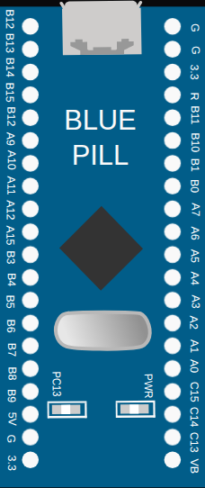

<!-- Generated by scripts/gen-boards.mjs — do not edit by hand. -->

The board as it appears on the Velxio canvas, with its full pin map
read live from the simulator (regenerated by `scripts/gen-boards.mjs`,
so it always matches what you can wire).

**Family:** [STM32](/docs/boards/stm32/) ·
**Languages:** Arduino C++

## Pins (40)

| Pin      | Signals |
| -------- | ------- |
| **PB12** | —       |
| **PB13** | —       |
| **PB14** | —       |
| **PB15** | —       |
| **PA8**  | —       |
| **PA9**  | —       |
| **PA10** | —       |
| **PA11** | —       |
| **PA12** | —       |
| **PA15** | —       |
| **PB3**  | —       |
| **PB4**  | —       |
| **PB5**  | —       |
| **PB6**  | —       |
| **PB7**  | —       |
| **PB8**  | —       |
| **PB9**  | —       |
| **5V**   | —       |
| **GND**  | —       |
| **3V3**  | —       |
| **GND**  | —       |
| **GND**  | —       |
| **3V3**  | —       |
| **NRST** | —       |
| **PB11** | —       |
| **PB10** | —       |
| **PB1**  | —       |
| **PB0**  | —       |
| **PA7**  | —       |
| **PA6**  | —       |
| **PA5**  | —       |
| **PA4**  | —       |
| **PA3**  | —       |
| **PA2**  | —       |
| **PA1**  | —       |
| **PA0**  | —       |
| **PC15** | —       |
| **PC14** | —       |
| **PC13** | —       |
| **VBAT** | —       |

Every pin above is clickable on the canvas — click one to start a
[wire](/docs/circuit-editor/wiring/). Board-level behavior, quirks and
example links live on the [family page](/docs/boards/stm32/).
