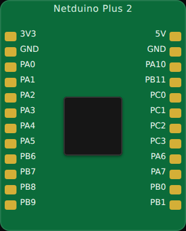

<!-- Generated by scripts/gen-boards.mjs — do not edit by hand. -->

The board as it appears on the Velxio canvas, with its full pin map
read live from the simulator (regenerated by `scripts/gen-boards.mjs`,
so it always matches what you can wire).

**Family:** [STM32](/docs/boards/stm32/) ·
**Languages:** Arduino C++

## About this board

The Netduino Plus 2 — an STM32F405 (Cortex-M4) on an Arduino-shaped board, so
shields and the pin naming you already know carry over.

In Velxio it runs as an STM32 through the STM32duino core, not through the
original .NET Micro Framework: you write the same Arduino C++ as on any other
board on this page.

## Start here

[New Netduino Plus 2 project](https://velxio.dev/example/stm32-netduino-plus2-blink) opens the editor with
this board and a working blink sketch. STM32 boards need a **paid plan** — see
[plans](/docs/getting-started/plans/).

## Pins (24)

<ul class="pin-grid">
<li>3V3</li>
<li>GND</li>
<li>PA0</li>
<li>PA1</li>
<li>PA2</li>
<li>PA3</li>
<li>PA4</li>
<li>PA5</li>
<li>PB6</li>
<li>PB7</li>
<li>PB8</li>
<li>PB9</li>
<li>5V</li>
<li>GND</li>
<li>PA10</li>
<li>PB11</li>
<li>PC0</li>
<li>PC1</li>
<li>PC2</li>
<li>PC3</li>
<li>PA6</li>
<li>PA7</li>
<li>PB0</li>
<li>PB1</li>
</ul>

Every pin above is clickable on the canvas — click one to start a
[wire](/docs/circuit-editor/wiring/). Board-level behavior, quirks and
example links live on the [family page](/docs/boards/stm32/).
