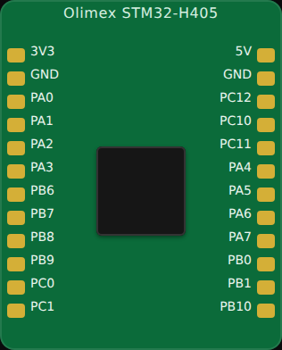

<!-- Generated by scripts/gen-boards.mjs — do not edit by hand. -->

The board as it appears on the Velxio canvas, with its full pin map
read live from the simulator (regenerated by `scripts/gen-boards.mjs`,
so it always matches what you can wire).

**Family:** [STM32](/docs/boards/stm32/) ·
**Languages:** Arduino C++

## Pins (24)

<ul class="pin-grid">
<li>3V3</li>
<li>GND</li>
<li>PA0</li>
<li>PA1</li>
<li>PA2</li>
<li>PA3</li>
<li>PB6</li>
<li>PB7</li>
<li>PB8</li>
<li>PB9</li>
<li>PC0</li>
<li>PC1</li>
<li>5V</li>
<li>GND</li>
<li>PC12</li>
<li>PC10</li>
<li>PC11</li>
<li>PA4</li>
<li>PA5</li>
<li>PA6</li>
<li>PA7</li>
<li>PB0</li>
<li>PB1</li>
<li>PB10</li>
</ul>

Every pin above is clickable on the canvas — click one to start a
[wire](/docs/circuit-editor/wiring/). Board-level behavior, quirks and
example links live on the [family page](/docs/boards/stm32/).
