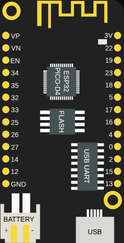

<!-- Generated by scripts/gen-boards.mjs — do not edit by hand. -->

The board as it appears on the Velxio canvas, with its full pin map
read live from the simulator (regenerated by `scripts/gen-boards.mjs`,
so it always matches what you can wire).

**Family:** [ESP32 (classic)](/docs/boards/esp32/) ·
**Languages:** Arduino C++, MicroPython, ESP-IDF

## Pins (26)

| Pin        | Signals |
| ---------- | ------- |
| **VP**     | —       |
| **VN**     | —       |
| **EN**     | —       |
| **GPIO34** | —       |
| **GPIO35** | —       |
| **GPIO32** | —       |
| **GPIO33** | —       |
| **GPIO25** | —       |
| **GPIO26** | —       |
| **GPIO27** | —       |
| **GPIO14** | —       |
| **GPIO12** | —       |
| **GND**    | —       |
| **GPIO13** | —       |
| **GPIO15** | —       |
| **GPIO2**  | —       |
| **GPIO0**  | —       |
| **GPIO4**  | —       |
| **GPIO16** | —       |
| **GPIO17** | —       |
| **GPIO5**  | —       |
| **GPIO18** | —       |
| **GPIO23** | —       |
| **GPIO19** | —       |
| **GPIO22** | —       |
| **3V**     | —       |

Every pin above is clickable on the canvas — click one to start a
[wire](/docs/circuit-editor/wiring/). Board-level behavior, quirks and
example links live on the [family page](/docs/boards/esp32/).
