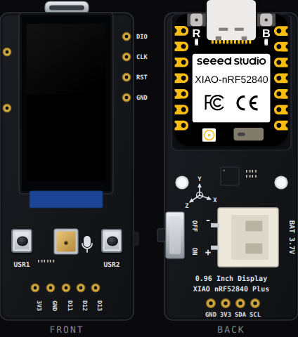

<!-- Generated by scripts/gen-boards.mjs — do not edit by hand. -->

The board as it appears on the Velxio canvas, with its full pin map
read live from the simulator (regenerated by `scripts/gen-boards.mjs`,
so it always matches what you can wire).

**Family:** [Pro boards](/docs/boards/pro-boards/) ·
**Languages:** Arduino C++

## About this board

Seeed's smallest display gadget: an ST7789 80 x 160 IPS panel on a carrier
with a pre-soldered XIAO nRF52840 Plus, two user buttons (USR1 on D6, USR2 on
D7), a 6-axis IMU and a battery connector. The canvas shows the board front and
back; the glass is the emulated controller's frame memory, filled by whatever
the sketch sends over SPI, and the buttons are clickable.

Drive the panel with **Seeed_GFX2**, which the board declares for you. Tilt
the board and set the battery level from **Sensors** on the canvas toolbar.
The PDM microphone and the I2S pads are not modelled.

## Start here

- [GraphicTest](https://velxio.dev/example/xiao-096-graphictest) — Seeed's ten
  drawing primitives, timed on the serial monitor.
- [Electronic Quicksand](https://velxio.dev/example/xiao-096-quicksand) — sand
  that follows the Tilt pad, through the on-board IMU.
- [Battery status](https://velxio.dev/example/xiao-096-battery) — Seeed's
  battery demo; drag the slider down a tenth of a volt.

## Pins (4)

<ul class="pin-grid">
<li>GND</li>
<li>3V3</li>
<li>SDA</li>
<li>SCL</li>
</ul>

Every pin above is clickable on the canvas — click one to start a
[wire](/docs/circuit-editor/wiring/). Board-level behavior, quirks and
example links live on the [family page](/docs/boards/pro-boards/).
