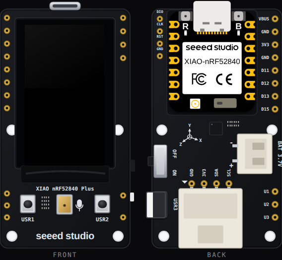

<!-- Generated by scripts/gen-boards.mjs — do not edit by hand. -->

The board as it appears on the Velxio canvas, with its full pin map
read live from the simulator (regenerated by `scripts/gen-boards.mjs`,
so it always matches what you can wire).

**Family:** [Pro boards](/docs/boards/pro-boards/) ·
**Languages:** Arduino C++

## About this board

An ST7789 135 x 240 IPS panel on a carrier with a pre-soldered XIAO nRF52840
Plus, three user buttons (USR1 D6, USR2 D7 and USR3 on the edge, D19), a Grove
I2C connector, a 6-axis IMU and a battery connector. The canvas shows the board
front and back; the Grove pads on the back are the ones you wire to.

Drive the panel with **Seeed_GFX2**, which the board declares for you. Tilt
the board and set the battery level from **Sensors** on the canvas toolbar.
The PDM microphone and the I2S pads are not modelled.

## Start here

- [GraphicTest](https://velxio.dev/example/xiao-114-graphictest) — Seeed's ten
  drawing primitives, timed on the serial monitor.
- [Grove SHT31](https://velxio.dev/example/xiao-114-grove-sht31) — a sensor on
  the Grove connector, sharing the bus with the IMU.
- [The three user buttons](https://velxio.dev/example/xiao-114-buttons) — each
  button counted on screen; USR1 toggles the backlight.

## Pins (15)

<ul class="pin-grid">
<li>GND</li>
<li>3V3</li>
<li>SDA</li>
<li>SCL</li>
<li>VBUS</li>
<li>GND.1</li>
<li>3V3.1</li>
<li>GND.2</li>
<li>D11</li>
<li>D12</li>
<li>D13</li>
<li>D15</li>
<li>U1</li>
<li>U2</li>
<li>U3</li>
</ul>

Every pin above is clickable on the canvas — click one to start a
[wire](/docs/circuit-editor/wiring/). Board-level behavior, quirks and
example links live on the [family page](/docs/boards/pro-boards/).
