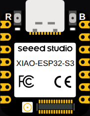

<!-- Generated by scripts/gen-boards.mjs — do not edit by hand. -->

The board as it appears on the Velxio canvas, with its full pin map
read live from the simulator (regenerated by `scripts/gen-boards.mjs`,
so it always matches what you can wire).

**Family:** [ESP32-S3 and ESP32-C3](/docs/boards/esp32-s3-c3/) ·
**Languages:** Arduino C++, MicroPython, ESP-IDF

## About this board

Seeed's thumb-sized ESP32-S3: the same S3 silicon as the
[DevKit](/docs/boards/reference/esp32-s3/) with only the pins that fit on a
board the size of a thumbnail. Code is interchangeable — what changes is which
GPIO numbers exist, so check the map below before moving a sketch across.

This is the plain XIAO S3. The camera-and-microphone variant is a separate
board, [XIAO ESP32S3 Sense](/docs/boards/reference/xiao-esp32s3-sense/).

## Start here

No separate starter: open
[New ESP32-S3 project](https://velxio.dev/example/esp32s3-blink-led) and swap
the board, or place it from **Add Component**.

## Pins (14)

<ul class="pin-grid">
<li>D0</li>
<li>D1</li>
<li>D2</li>
<li>D3</li>
<li>D4</li>
<li>D5</li>
<li>D6</li>
<li>D7</li>
<li>D8</li>
<li>D9</li>
<li>D10</li>
<li>3V3</li>
<li>GND</li>
<li>5V</li>
</ul>

Every pin above is clickable on the canvas — click one to start a
[wire](/docs/circuit-editor/wiring/). Board-level behavior, quirks and
example links live on the [family page](/docs/boards/esp32-s3-c3/).
