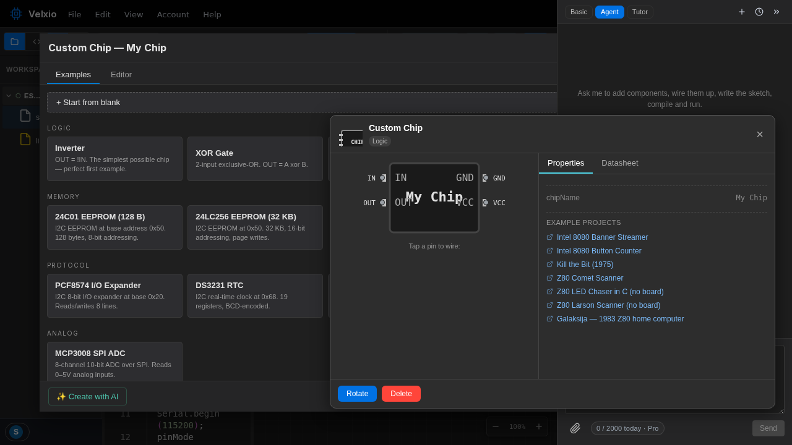

A **custom chip** is a component you program yourself. You write plain C
against the `velxio-chip.h` API, Velxio compiles it to WebAssembly in the
cloud, and the result behaves like any catalog part: it has pins you wire,
attributes you edit, and logic that runs inside the simulation.

## When to build one

- The IC you need isn't in the catalog (an obscure shift register, a
  proprietary sensor protocol).
- You want a test fixture — a pulse generator, a protocol exerciser, a
  fake sensor with scripted values.
- You're teaching digital logic and want students to _implement_ the
  chip, not just use it.

## The five-minute version

1. Open the [component picker](/docs/circuit-editor/placing-components/)
   and add a **Custom Chip** to the canvas.
2. Open the chip's editor (right-click the chip). You get two files:
   - **C source** — the behavior;
   - **`chip.json`** — the manifest: name, pins, attributes.
3. Start from the built-in **Inverter** example:

```c
#include "velxio-chip.h"
#include <stdlib.h>

typedef struct { vx_pin in, out; } chip_state_t;

static void on_in_change(void* ud, vx_pin pin, int value) {
  chip_state_t* s = ud;
  vx_pin_write(s->out, value ? VX_LOW : VX_HIGH);
}

void chip_setup(void) {
  chip_state_t* s = malloc(sizeof *s);
  s->in  = vx_pin_register("IN",  VX_INPUT);
  s->out = vx_pin_register("OUT", VX_OUTPUT);
  vx_pin_write(s->out, vx_pin_read(s->in) ? VX_LOW : VX_HIGH);
  vx_pin_watch(s->in, VX_EDGE_BOTH, on_in_change, s);
  vx_log("inverter ready");
}
```

with its manifest:

```json
{
  "schema": "velxio-chip/v1",
  "name": "Inverter",
  "pins": ["IN", "OUT", "GND", "VCC"],
  "attributes": []
}
```

4. **Compile** in the dialog — errors come back like any C compiler's.
5. Wire `IN` to a button and `OUT` to an LED, press **Run**, and toggle
   away.

The chip editor, with the C source and the manifest side by side:



## How chips execute

The host calls your `chip_setup()` once per chip instance. After that the
chip is **reactive**: your code only runs inside callbacks — a watched pin
changed, an I2C byte arrived, a timer fired. There is no main loop to
block, which is what keeps custom chips cheap enough to sprinkle around a
circuit.

## Built-in example chips

The chip editor ships working sources you can load and modify: logic
gates (inverter, XOR), shift registers (74HC595, CD4094), I2C parts
(PCF8574, DS3231 RTC, 24Cxx EEPROMs), an SPI ADC (MCP3008), a UART
ROT13 transformer, a pulse counter — and a **retro CPU collection**
(Intel 4004 and friends) for the truly adventurous.

Next: the [chips API reference](/docs/custom-chips/api/).
