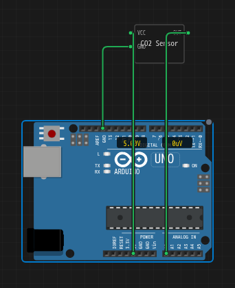
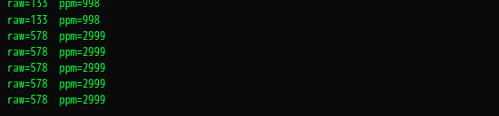

The shortest complete programmable sensor: a slider from 400 to 5000 ppm,
a voltage on a pin, and an Arduino reading it back. Ten minutes end to
end, and the shape you will copy for every analog sensor after this.

:::tip[Open the finished circuit]
Everything below, already wired and ready to run:
[CO2 Sensor (live slider)](https://velxio.dev/example/co2-sensor-live-slider).
The same chip is also a template in the new-chip dialog, if you would
rather drop it into a project of your own.
:::

## What you are building

```
   [ CO2 Sensor chip ]                 [ Arduino Uno ]
        VCC  o------------------------o 5V
        GND  o------------------------o GND
        OUT  o------------------------o A0

   slider 400..5000 ppm   ->   OUT 0..5 V   ->   analogRead(A0)
```

## Step 1: create the chip

Add a custom chip from the editor's file explorer. A dialog offers the
built-in templates plus **Start from blank**; take the blank one to
follow along. Either way you end up with two files: the manifest
(`chip.json`) and the source (`chip.c`).

## Step 2: the manifest

Three pins, one attribute, one control. The `id` of the control and the
`name` of the attribute must match; that is what binds them.

```json title="chip.json"
{
  "schema": "velxio-chip/v1",
  "name": "CO2 Sensor",
  "description": "Analog CO2 sensor with a live ppm slider. OUT maps 400-5000 ppm to 0-5 V.",
  "pins": ["VCC", "GND", "OUT"],
  "attributes": [
    { "name": "ppm", "label": "CO2 (ppm)", "type": "int",
      "default": 1000, "min": 400, "max": 5000, "step": 10 }
  ],
  "controls": [
    { "id": "ppm", "label": "CO2 (ppm)", "type": "range",
      "min": 400, "max": 5000, "step": 10, "unit": "ppm" }
  ]
}
```

## Step 3: the source

A repeating timer converts ppm to volts and drives the pin. Note where
`vx_attr_read` sits: **inside** the callback, so every tick sees the
slider's current position.

```c title="chip.c"
#include "velxio-chip.h"

#define PPM_MIN   400.0
#define PPM_MAX  5000.0
#define VOLTS_MAX   5.0

typedef struct {
  vx_pin   out;
  vx_attr  ppm;
  vx_timer timer;
} chip_state_t;

static chip_state_t S;

static void on_tick(void *user_data) {
  (void)user_data;
  double ppm = vx_attr_read(S.ppm);          /* live slider value */
  if (ppm < PPM_MIN) ppm = PPM_MIN;
  if (ppm > PPM_MAX) ppm = PPM_MAX;
  double volts = (ppm - PPM_MIN) / (PPM_MAX - PPM_MIN) * VOLTS_MAX;
  vx_pin_dac_write(S.out, volts);
}

void chip_setup(void) {
  S.out   = vx_pin_register("OUT", VX_ANALOG);
  S.ppm   = vx_attr_register("ppm", 1000);
  S.timer = vx_timer_create(on_tick, 0);
  vx_timer_start(S.timer, 50000000ULL, true);  /* 50 ms, in nanoseconds */
  on_tick(0);                                  /* drive the initial level */
  vx_log("co2 sensor ready");
}
```

Three details that matter:

- `VX_ANALOG` on the pin. A digital pin cannot carry an intermediate
  voltage, and `vx_pin_dac_write` on it will not do what you want.
- `vx_timer_start` takes **nanoseconds**. `50000000ULL` is 50 ms. This is
  the single most common typo in a first chip.
- The bare `on_tick(0)` before returning. Without it the pin sits at 0 V
  until the first timer fires, and a fast sketch reads that as a spurious
  400 ppm.

Press **Compile**.

## Step 4: wire it

Drop the chip on the canvas next to an Arduino Uno and connect `VCC` to
`5V`, `GND` to `GND`, and `OUT` to `A0`.



## Step 5: the sketch

```cpp title="sketch.ino"
void setup() {
  Serial.begin(115200);
}

void loop() {
  int raw = analogRead(A0);
  float volts = raw * (5.0f / 1023.0f);
  float ppm = 400.0f + volts / 5.0f * 4600.0f;
  Serial.print("raw="); Serial.print(raw);
  Serial.print("  ppm="); Serial.println(ppm, 0);
  delay(500);
}
```

## Step 6: run it and drag

Press **Run**, then **click the chip**. The slider panel opens:


Drag it and the serial output follows within one `delay(500)`:



That is the whole loop: the slider writes the attribute, the timer reads
it 20 times a second, the pin voltage changes, and `analogRead` sees it.

## When it does not work

| What you see | Almost always |
| --- | --- |
| Clicking the chip opens nothing | The simulation is stopped: the panel opens only while it runs |
| The slider appears but the reading never moves | `vx_attr_read` is being called in `chip_setup()` and cached, instead of inside `on_tick` |
| `analogRead` returns 0 or 1023 only | The pin was registered as a digital mode rather than `VX_ANALOG` |
| The value updates once and freezes | `vx_timer_start` was called with `repeat` false, or the interval was written in milliseconds so the next tick is 50000 seconds away |
| Serial shows 400 ppm for the first moment | The initial `on_tick(0)` call is missing |

## Next

- The same idea behind a digital protocol:
  [temperature and humidity over I2C](/docs/custom-chips/programmable-sensors/i2c-env/).
- Every field you can put in `controls`:
  [the reference](/docs/custom-chips/programmable-sensors/reference/).
- Keep it for other projects: [My Chips](/docs/custom-chips/my-chips/).
