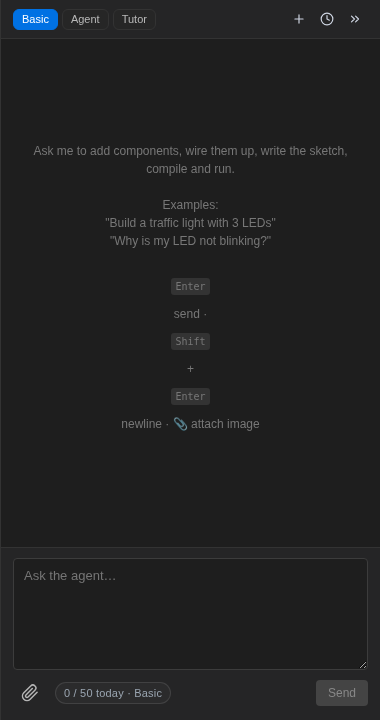

Der **Grundmodus** (Basic) ist ein Chat mit Ihrem Projekt als Kontext: Der Assistent sieht
die Schaltung auf der Arbeitsfläche und den Code im Editor, sodass Sie Fragen
stellen können, wie Sie sie einem Kollegen am nächsten Arbeitsplatz stellen würden:

Gute Fragen für den Grundmodus:

- _"Warum blinkt meine LED nicht?"_
- _"Was bedeutet dieser Kompilierungsfehler?"_ (fügen Sie ihn ein, oder fragen Sie einfach — er kann
  die Ausgabe lesen)
- _"Welchen Pin sollte ich für I2C auf diesem Board verwenden?"_
- _"Erkläre, was dieses Skript Zeile für Zeile tut."_

## Mechanik

- **Enter** sendet, **Shift+Enter** erzeugt eine neue Zeile.
- **Bild anhängen** (Attach an image) mit der Büroklammer (PNG/JPEG/WebP/GIF bis 4 MB) —
  ein Foto eines echten Breadboards, eines Schaltplans, eines Screenshots.
- **Sitzungen**: Starten Sie eine neue Unterhaltung mit **+**, rufen Sie alte
  über die Verlaufs-Schaltfläche auf.
- Der Zähler unten zeigt Ihr **Kontingent** (cycles) für den Tag und
  den Monat — siehe [Tarife](/docs/de/getting-started/plans/).

Der Grundmodus spricht nur. Wenn Sie möchten, dass der Assistent _Aktionen_ auf der
Arbeitsfläche durchführt, wechseln Sie in den [Agentenmodus](/docs/de/ai/agent-mode/).

----- END PAGE -----
