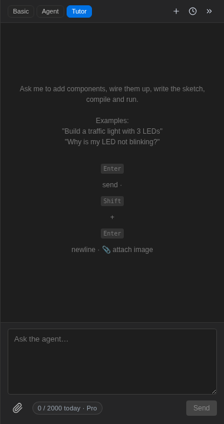

El modo **Tutor** convierte al asistente en un profesor de electrónica que
enseña _sobre tu circuito_ — no desde un libro de texto en abstracto:

Así es como se ve la tutoría:

- Dile dónde estás — _"Soy nuevo, enséñame cómo funcionan los LEDs y las
  resistencias"_ o _"Conozco Arduino, ayúdame a empezar con I2C"_.
- Propone un **pequeño ejercicio** en el lienzo, tú lo construyes, y él
  **comprueba tu circuito y código reales** — señalando el cable que
  cruzaste o la resistencia de pull-up que olvidaste.
- La teoría llega cuando explica _por qué_ — la ley de Ohm cuando tu LED está
  tenue, el rebote cuando tu contador salta.

Debido a que el simulador es real ([firmware realmente en ejecución](/docs/es/getting-started/faq/)),
todo lo que enseña el tutor es verificable en el momento: mídelo con el
[osciloscopio](/docs/es/instruments/oscilloscope/), léelo en el
[monitor serie](/docs/es/programming/serial-monitor/).

El modo Tutor comparte la misma cuota de **ciclos** que los otros modos —
consulta [planes](/docs/es/getting-started/plans/).
