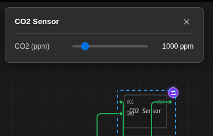

Un **sensor programable** es un chip personalizado ordinario cuyas lecturas
controlas desde un deslizador *mientras la simulación se ejecuta*. Un sensor de CO2 cuyos ppm
barres para probar un umbral de alarma. Una sonda de temperatura que empujas más allá de
85 °C para ver qué hace el firmware. Un sensor de luz que atenuas a mano.

Nada del chip cambia: es el mismo componente WebAssembly
descrito en [Primeros pasos](/docs/es/custom-chips/getting-started/). Lo que
esta página añade es el cable que lleva un valor de deslizador a un chip que ya
se está ejecutando, sin recompilar ni reiniciar nada.

## El contrato, en tres partes

Cada sensor programable son estas tres piezas y nada más.

**1. Un atributo** contiene el valor ajustable.

```c
S.ppm = vx_attr_register("ppm", 1000);
```

**2. Una entrada `controls`** en `chip.json` coloca un deslizador en pantalla. Se
dirige al atributo **por el mismo id**:

```json
"controls": [
  { "id": "ppm", "label": "CO2 (ppm)", "type": "range",
    "min": 400, "max": 5000, "step": 10, "unit": "ppm" }
]
```

**3. Tu código vuelve a leer el atributo** cada vez que necesita el valor:

```c
double ppm = vx_attr_read(S.ppm);   /* el valor del deslizador en este momento */
```

Pulsa **Run** (Ejecutar), haz clic en el chip, y esto se abre:



Ese tercer punto es el que confunde a la gente. Lee el atributo una vez
en `chip_setup()` y guárdalo en una variable, y el deslizador aparecerá,
se moverá, y no hará absolutamente nada. `vx_attr_read` es barato; llámalo dentro
de tu callback de temporizador, tu manejador de lectura I2C, donde sea que el valor
se necesite realmente.

:::tip[Puede que ya tengas deslizadores]
Si omites la sección `controls` por completo, **cualquier atributo que declare
tanto `min` como `max` aún recibe un deslizador**. Los chips que escribiste antes de que
esto existiera a menudo ya son ajustables. `controls` es cómo renombras un deslizador,
le das una unidad, lo haces logarítmico, o lo conviertes en un botón.
:::

## Cómo llega el valor a tu chip

Vale la pena entenderlo, porque los dos motores de simulación toman rutas
diferentes y los modos de fallo difieren.

| Paso | Qué sucede |
| --- | --- |
| Arrastras el deslizador | El panel escribe en el registro de actualización de sensores, claveado por esta instancia de chip |
| Motor de navegador (AVR, RP2040, ESP32 en navegador) | El valor se escribe directamente en el mapa de atributos que el WebAssembly en ejecución lee en cada `vx_attr_read`. Sin paso de mensajes, sin reinicio |
| ESP32 bajo QEMU | El chip vive en un worker, por lo que el valor se reenvía a él como una actualización de atributo y se aplica allí |
| Cada 250 ms de inactividad | Los últimos valores se reflejan en las propiedades guardadas del componente, por lo que la posición del deslizador sobrevive a un guardado y recarga |

Dos consecuencias que vale la pena conocer:

- **No hay paso de "aplicar".** La siguiente `vx_attr_read` devuelve el nuevo
  valor. Si tu chip solo lee el atributo una vez por segundo, ese es el tiempo
  que tarda el deslizador en hacer algo visiblemente.
- **El panel es por instancia.** Dos copias del mismo chip en un lienzo
  tienen deslizadores independientes, porque los controles se sintetizan a partir del
  manifiesto de cada instancia.

## Valores predeterminados de diseño versus valores en vivo

Son superficies diferentes y la gente las confunde:

- **Detenido**: haz clic derecho en el chip para abrir el inspector de piezas. Lo que
  estableces allí es el valor predeterminado guardado del atributo, el valor con el que
  el chip comienza.
- **En ejecución**: haz clic en el chip. Se abre el panel de deslizadores. Lo que estableces allí
  es el valor en vivo, aplicado inmediatamente.

## Prueba uno primero

Cada patrón tiene un circuito ejecutable en la galería. Pulsa Run (Ejecutar), luego
haz clic en el chip:

| Ejemplo | Qué enseña |
| --- | --- |
| [Sensor de CO2 (deslizador en vivo)](https://velxio.dev/example/co2-sensor-live-slider) | La receta analógica: deslizador a voltaje a `analogRead` |
| [Sensor ambiental I2C (deslizadores en vivo)](https://velxio.dev/example/i2c-env-sensor-live-sliders) | Dos deslizadores detrás de un mapa de registros en `0x44` |
| [Sensor de movimiento (botón de simulación)](https://velxio.dev/example/motion-sensor-sim-button) | El control `button`: disparo momentáneo más un deslizador de retención |
| [Luz nocturna (deslizador de lux logarítmico)](https://velxio.dev/example/night-light-log-slider) | `scale: "log"`: cinco décadas de lux en un deslizador, la lámpara se activa por debajo de 50 lx |
| [Termómetro SPI (deslizador en vivo)](https://velxio.dev/example/spi-thermometer-live-slider) | Temporización de esclavo SPI: enclavamiento en el flanco descendente de CS |
| [Sensor de aire UART (deslizador en vivo)](https://velxio.dev/example/uart-air-sensor-live-slider) | Sensor serial de tipo push en SoftwareSerial |

## Dónde ir a continuación

- [Tutorial: un sensor de CO2 analógico](/docs/es/custom-chips/programmable-sensors/co2-analog/)
  — el ejemplo completo más corto, desde chip vacío hasta `analogRead` siguiendo
  un deslizador.
- [Tutorial: temperatura y humedad sobre I2C](/docs/es/custom-chips/programmable-sensors/i2c-env/)
  — el patrón para cualquier sensor de protocolo digital, con dos deslizadores y un
  mapa de registros.
- [Referencia de `controls`](/docs/es/custom-chips/programmable-sensors/reference/)
  — cada campo, las reglas de respaldo automáticas, y qué verificar cuando un
  deslizador no hace nada.

:::note[Gratis]
Todo en esta página es gratis, en todos los planes: escribir un chip, compilarlo,
ejecutarlo, y arrastrar sus deslizadores. Lo que es de pago es que la IA
escriba un chip por ti (Maker y superior) y la
biblioteca del lado del servidor [My Chips](/docs/es/custom-chips/my-chips/) (Pro).
:::
