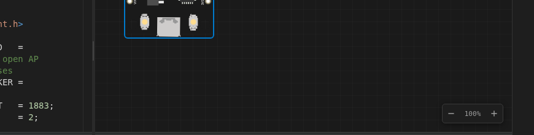
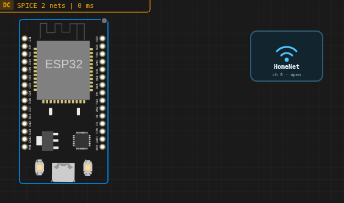
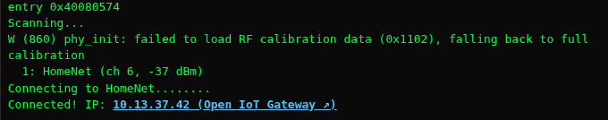
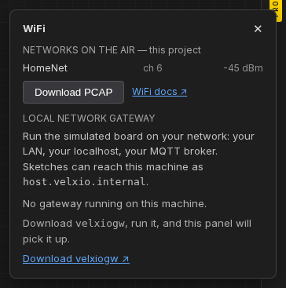

Las placas ESP32 en Velxio vienen con **WiFi funcional**: la radio emulada
ve un punto de acceso abierto llamado **`Velxio-GUEST`**, se asocia,
obtiene una dirección IP mediante DHCP y accede a Internet a través de la
puerta de enlace NAT del emulador. El mismo sketch exacto se ejecuta en el chip físico.

## Arduino

```cpp
#include <WiFi.h>

const char* WIFI_SSID = "Velxio-GUEST";  // open AP, no password

void setup() {
  Serial.begin(115200);
  WiFi.begin(WIFI_SSID);
  while (WiFi.status() != WL_CONNECTED) { delay(250); Serial.print("."); }
  Serial.printf("\nConnected! IP: %s\n", WiFi.localIP().toString().c_str());
}
```

El monitor serie muestra el familiar mensaje de arranque `wifi:connected` y
la concesión DHCP, porque _es_ la pila WiFi real en ejecución:



## MicroPython

```python
import network

WIFI_SSID = "Velxio-GUEST"

sta = network.WLAN(network.STA_IF)
sta.active(True)
sta.connect(WIFI_SSID)
while not sta.isconnected():
    pass
print("Connected, IP:", sta.ifconfig()[0])
```

## Sus propias redes: puntos de acceso personalizados

Con un plan Maker no está limitado a las redes de demostración integradas: añada
una pieza de **Punto de Acceso WiFi** al lienzo (busque "WiFi Access Point" en el
selector de piezas) y la radio emulada transmitirá **su SSID** en su lugar. El
sketch se conectará entonces a la red que realmente nombra:

```cpp
WiFi.begin("HomeNet", "");   // the SSID on your Access Point part
```



La pieza no tiene pines: no es un componente eléctrico, es espacio aéreo.
En cuanto un proyecto contiene al menos una pieza de punto de acceso, las redes
integradas se silencian: un escaneo ve exactamente lo que define el lienzo. Añada
varias piezas para probar una interfaz de selección de red; cada una tiene su propio
canal y potencia de señal, y los escaneos repetidos varían unos pocos dB como
lo harían los reales.

Dos propiedades merecen atención:

- **Internet** — desactívela y la red quedará aislada: la placa
  se asocia y obtiene una IP mediante DHCP, pero nada sale hacia el exterior. Ese es el
  escenario de aprovisionamiento / portal cautivo, ahora comprobable en el simulador.
- **Password** — se guarda con la pieza y se muestra en su tarjeta, pero la
  red sigue transmitiendo autenticación abierta hasta que llegue la emulación WPA2.
  Los sketches que pasan una contraseña se conectan de todos modos.

El firmware cargado también se beneficia: un binario compilado en otro lugar se
conecta a la red que nombre, siempre que una pieza de punto de acceso transmita
ese SSID — sin necesidad de recompilar.

Cuando se ejecuta, el escaneo encuentra exactamente su red y la placa se une a ella:



Pruébelo con un clic: el ejemplo de la galería **Connect to your own WiFi
network** se abre con la pieza ya en el lienzo.

## El panel WiFi

El icono WiFi en la barra de herramientas es un botón dividido. El icono en sí mantiene su
acción de un clic — con una IP abre el servidor web de la placa a través de la
puerta de enlace IoT. El pequeño indicador junto a él abre el **panel WiFi**:



- las redes actualmente en el aire (sus puntos de acceso, o el conjunto
  integrado), con la asociada marcada;
- el estado de conexión e IP de la placa;
- **Download PCAP** — el tráfico 802.11 de la ejecución como archivo de captura que
  Wireshark abre directamente (tramas de gestión, DHCP, DNS, TCP, con
  marcas de tiempo simuladas). No se sube nada; el archivo se genera en
  su navegador;
- el emparejamiento de la [puerta de enlace de red local](/docs/es/wifi-iot/local-gateway/).

## A qué puede acceder

Una vez conectado, los sockets TCP/UDP estándar, los clientes HTTP y las bibliotecas MQTT
funcionan contra **servidores reales en Internet** — brokers MQTT públicos, API
REST, NTP. Consulte [MQTT y HTTP](/docs/es/wifi-iot/mqtt-http/) para ver proyectos
completos.

## Qué placas

WiFi está disponible en toda la familia ESP32 simulada — las placas ESP32
clásicas, ESP32-S3, ESP32-C3, ESP32-C6 y ESP32-C5 (y sus variantes XIAO / Nano /
M5Stack). El estado de publicidad Bluetooth también se informa para
sketches que inicializan BLE.
