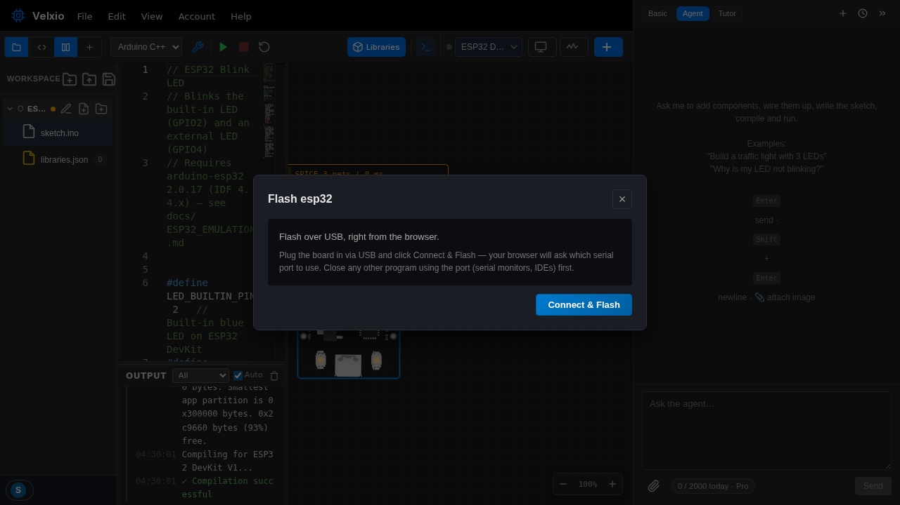

Cuando tu proyecto funciona en el simulador, puedes ponerlo en una
**placa real** sin instalar nada: Velxio graba el firmware compilado
por USB, directamente desde el navegador.

## Requisitos

- Un navegador basado en Chromium (Chrome o Edge). El grabador utiliza
  las APIs Web Serial y WebUSB del navegador, que Firefox y Safari no
  incluyen. Las placas de la familia Pico aún tienen un botón de
  **Download .uf2** allí (ver más abajo).
- Un cable USB con capacidad de datos para tu placa.
- Cierra cualquier otra cosa que use el puerto primero (monitores serie,
  IDEs, picotool): el navegador necesita acceso exclusivo.



## Grabación

1. Haz clic derecho en la placa del lienzo y elige **Flash to real board**.
2. Haz clic en **Connect & flash**. El navegador pregunta qué dispositivo USB conceder;
   elige tu placa.
3. Velxio utiliza la compilación que ya hizo para esa placa (el mismo binario
   que estaba ejecutando el simulador). Si el código ha cambiado desde entonces, recompila
   primero y la salida del compilador se transmite al diálogo.
4. Observa la barra de progreso; cuando termine, la placa se reinicia en tu
   proyecto.

El diálogo elige el protocolo para el objetivo:

| Familia | Cómo se escribe | La placa debe estar |
| --- | --- | --- |
| ESP32, S3, C3, C6 | esptool a través del puerto serie, el `.bin` combinado | enchufada; mantén pulsado BOOT si no responde |
| Arduino Uno, Nano, Mega, ATtiny85 | STK500 contra el bootloader de la placa, el `.hex` | enchufada (ATtiny85: a través de un Arduino ejecutando ArduinoISP) |
| Raspberry Pi Pico, Pico W, Pico 2, placas Pimoroni RP2040 / RP2350 | PICOBOOT sobre WebUSB, el `.uf2` que construyó picotool | en modo **BOOTSEL** (sección siguiente) |

## Placas de la familia Pico: BOOTSEL primero

Un RP2040 o RP2350 se programa mediante su bootloader, una personalidad USB
separada que el chip solo muestra en modo **BOOTSEL**. Dos formas de llegar
allí:

- **A mano**: mantén pulsado el botón BOOTSEL mientras conectas la placa, y luego
  suéltalo. La placa se monta como una unidad USB llamada `RPI-RP2` (RP2040) o
  `RP2350`.
- **Desde el diálogo**: el diálogo de grabación para estas placas tiene un
  botón **Reboot into bootloader over USB**. Funciona cuando la placa está
  ejecutando un sketch que Velxio construyó (el núcleo de Arduino se reinicia al
  abrir a 1200 baudios) o MicroPython (el REPL ejecuta `machine.bootloader()`). El
  navegador solicita el puerto serie de la placa, la placa se desconecta y
  vuelve como bootloader. Luego haz clic en **Connect & flash** y elige el
  dispositivo `RP2 Boot` / `RP2350 Boot`.

Dos clics, dos solicitudes de permiso: el puerto serie para el reinicio y
el dispositivo USB para la escritura. Una vez que la placa está en BOOTSEL, las
grabaciones posteriores solo necesitan la segunda.

El diálogo rechaza una imagen que no coincide con el chip que respondió
(una compilación RP2350 en un RP2040, una compilación RISC-V en una configuración
ARM) antes de borrar nada, verifica cada byte después de escribir y
reinicia la placa en el programa.

### Windows y un RP2040: instala WinUSB una vez

El bootloader RP2040 no incluye un descriptor de controlador de Windows, por lo que el navegador
no puede reclamarlo hasta que WinUSB esté vinculado a él. Configuración única:

1. Pon la placa en BOOTSEL y conéctala.
2. Descarga y ejecuta [Zadig](https://zadig.akeo.ie).
3. Elige `RP2 Boot (Interface 1)` de la lista (Options, List All
   Devices si está oculto), selecciona **WinUSB** como controlador y haz clic en
   **Install Driver**.

Las placas RP2350 (Pico 2, Pico 2 W, los Unicornios "Pico 2 W Aboard" de
Pimoroni, Badger 2350) no necesitan nada: su bootloader lleva el
descriptor y Windows vincula WinUSB por sí mismo. macOS no necesita nada en
ninguno de los dos chips.

### Linux: una regla udev

Linux asigna los dispositivos USB a root por defecto. Crea
`/etc/udev/rules.d/99-velxio-rp2.rules` con:

```
SUBSYSTEM=="usb", ATTRS{idVendor}=="2e8a", MODE="0666", TAG+="uaccess"
```

luego `sudo udevadm control --reload-rules && sudo udevadm trigger` y
vuelve a conectar la placa. El puerto serie utilizado para el paso de reinicio también
necesita la pertenencia habitual al grupo `dialout`.

### Cualquier navegador: descarga el .uf2

El diálogo de grabación para una placa de la familia Pico siempre ofrece
**Download .uf2** (en Firefox y Safari, donde el navegador no puede grabar, ese es
todo el diálogo). Guarda el archivo, pon la placa en BOOTSEL y suelta el archivo en
la unidad `RPI-RP2` / `RP2350`: la placa se reinicia en tu sketch en el momento
en que termina la copia.

### Proyectos MicroPython en un Pico

El diálogo sube los archivos `.py` del proyecto a través del REPL y se reinicia
en `main.py`. El propio MicroPython ya tiene que estar en la placa: es
un `.uf2` que sueltas en la unidad BOOTSEL una vez (las placas Pimoroni lo
incluyen; descargas en
[pimoroni-pico-rp2350](https://github.com/pimoroni/pimoroni-pico-rp2350/releases)
y [micropython.org](https://micropython.org/download/)).

## Solución de problemas

- **"No board in BOOTSEL mode was found"**: el selector de dispositivos estaba vacío.
  Usa el botón de reinicio o mantén pulsado BOOTSEL mientras conectas, y luego conecta
  de nuevo.
- **"The board in BOOTSEL is an RP2040 but this project is built for
  RP2350"**: Pimoroni vendió el Stellar y Galactic Unicorn con un Pico W
  (RP2040) hasta enero de 2025 y con un Pico 2 W (RP2350) desde entonces. Comprueba
  la etiqueta de tu unidad y elige la placa correspondiente en el editor.
- **"Could not claim the USB device"** en Windows con un RP2040: el
  paso de Zadig anterior. En Linux: la regla udev anterior.
- **El reinicio serie no hizo nada**: un sketch construido con la pila USB
  deshabilitada no se puede reiniciar por USB. Mantén pulsado BOOTSEL mientras conectas.

## Simula primero, graba después

Esto cierra el ciclo que hace que Velxio sea útil para el trabajo real: itera
rápidamente en el simulador (sin cable, sin desgaste del hardware, reinicios
instantáneos), y luego graba el mismo artefacto de compilación cuando se comporta
correctamente.
