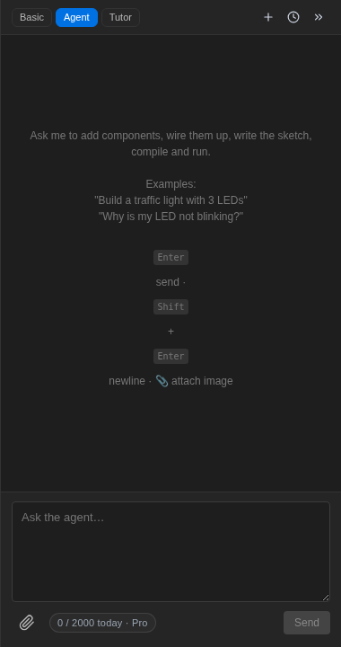

Le mode **Agent** donne des mains à l'assistant. Demandez un circuit et il
ajoutera les composants, les câblera, écrira le code, compilera et exécutera —
directement sur votre canevas, pendant que vous regardez :

Essayez des invites comme :

- _"Construis un feu de signalisation avec 3 LED."_
- _"Ajoute un écran OLED à cette carte et affiche un compteur dessus."_
- _"Mes lectures de bouton rebondissent — corrige le code."_
- _"Convertis ce projet en MicroPython."_

## Vous gardez le contrôle

Chaque action aboutit dans votre projet normal : les pièces apparaissent sur le canevas,
les modifications s'affichent dans l'éditeur de code, et l'historique d'annulation vous appartient. Inspectez
ce qu'il a fait, ajustez-le, ou demandez l'étape suivante. Si une exécution échoue, l'agent
lit la sortie du compilateur et le moniteur série de la même manière que vous
le feriez, et itère.

## Bien travailler avec l'agent

- **De petites étapes valent mieux que de longs discours** — "ajoute un DHT22 et affiche la température"
  donne de meilleurs résultats qu'un paragraphe d'exigences.
- **Laissez-le terminer** — un tour de l'agent peut comporter plusieurs actions (placer, câbler,
  coder, compiler, exécuter) ; le panneau raconte au fur et à mesure.
- Joignez une image d'un circuit que vous souhaitez reproduire — il peut travailler à partir d'une
  photo ou d'un schéma.

Les tours de l'agent coûtent plus de **cycles** que les réponses de discussion ; le compteur de quota en
bas du panneau suit ce qui reste aujourd'hui. Voir
[plans](/docs/fr/getting-started/plans/).
