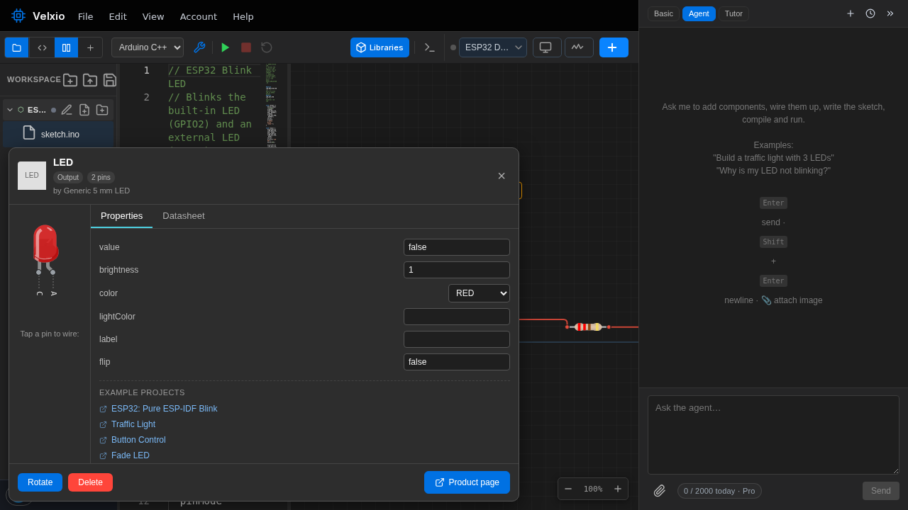
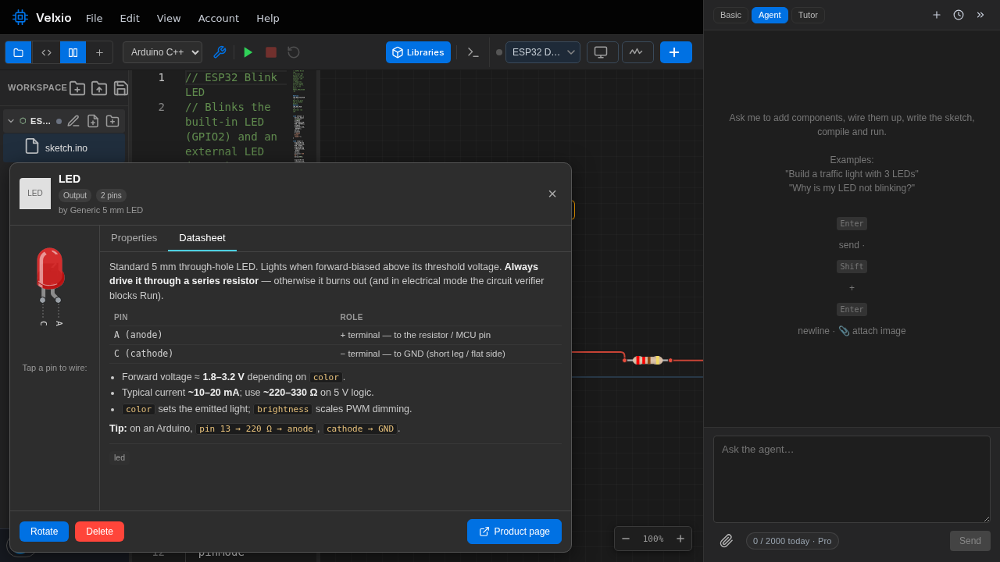

**Cliquez avec le bouton droit sur un composant** sur le canevas pour ouvrir son inspecteur :

Le côté gauche affiche le composant avec ses broches numérotées — **cliquez sur une broche pour démarrer
un fil** à partir de celle-ci. La barre inférieure contient les boutons **Rotate** (pivoter) et **Delete** (supprimer).

## Onglet Propriétés

Tout ce qui est modifiable sur le composant : la valeur d'une résistance, la couleur d'une LED,
l'adresse I2C d'un capteur, la variante d'un afficheur. Sous les propriétés, les liens
**Example projects** (projets d'exemple) ouvrent des circuits prêts à l'emploi qui utilisent ce composant.

Les modifications de propriétés prennent effet immédiatement — changez une résistance de 220 à
10k pendant que la simulation tourne et observez la LED s'atténuer.

## Onglet Fiche technique

Une fiche technique pratique et condensée : ce qu'est le composant, les rôles des broches dans un
tableau, les valeurs électriques importantes (tension directe, courant typique,
résistance série recommandée…), et des conseils d'utilisation. Le bouton **Product
page** (page produit) renvoie vers le composant réel, afin que vous puissiez acheter exactement ce que vous avez
simulé.

Le même contenu se trouve dans la
[référence des composants](/docs/fr/parts/overview/) de cette documentation — les deux sont générés à partir de la
même source, ils ne peuvent donc jamais diverger.
