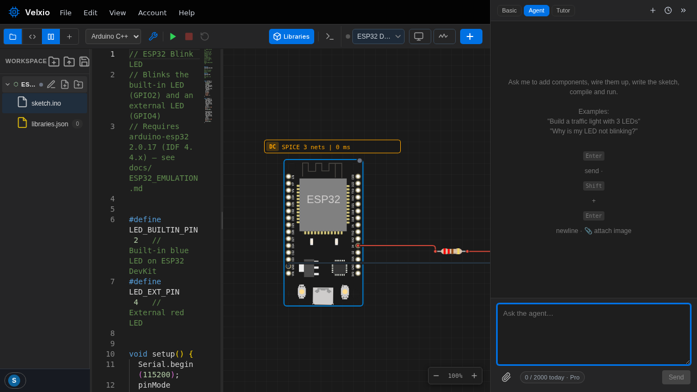
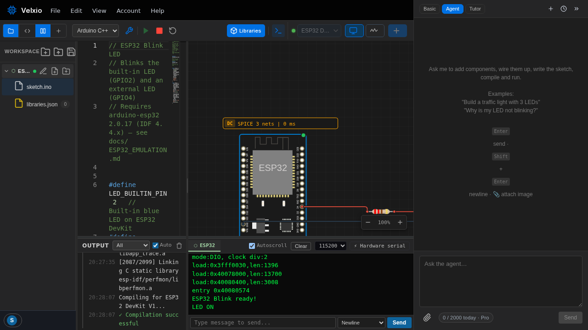

The fastest way to understand Velxio is to run something. In this tutorial
you'll open the classic _blink_ example, run it, watch a simulated ESP32
drive a real LED circuit, and then change the code.

## 1. Open the example

Go to [velxio.dev/example/esp32-blink-led](https://velxio.dev/example/esp32-blink-led)
(or find **ESP32 Blink** in the [examples gallery](/docs/getting-started/examples-gallery/)).



You get a complete project: the **code** on the left (an Arduino sketch that
toggles two LEDs), and the **circuit** in the middle — an ESP32 DevKit wired
through a resistor to an external LED.

## 2. Press Run

Click the green **Run** button in the toolbar (or press **Ctrl+B** to
compile first). Velxio compiles your sketch with the real Arduino/ESP-IDF
toolchain in the cloud — the **Output** console at the bottom left streams
the compiler's progress, exactly like the Arduino IDE would.

The first compile of a session can take a little while; after that, builds
are much faster.

## 3. Watch it run

When the build finishes, the firmware boots on the emulated ESP32:



Three things happen at once:

- The **LED on the canvas blinks** — the simulation drives the actual
  component, through the actual resistor.
- The **serial monitor** shows the boot log and then `LED ON` / `LED OFF`,
  straight from `Serial.println()` in the sketch.
- The yellow **SPICE badge** above the circuit shows the analog engine
  solving the LED's current path.

## 4. Make it yours

Edit the sketch — for example, change the delay to make it blink faster:

```cpp
delay(100);   // was 500
```

Press **Run** again. That's the whole loop: edit, run, observe.

## 5. Save it

Click the **save icon** above the file tree (or **Ctrl+S**), give the
project a name, and it's stored in your account. See
[Saving and opening projects](/docs/getting-started/projects/).

> **Tip:** stuck at any point? Open the AI assistant on the right and ask —
> "why is my LED not blinking?" is one of its example prompts for a reason.
> See [AI assistant](/docs/ai/overview/).

## Where next

- [Interface tour](/docs/getting-started/interface-tour/) — what every
  panel and button does.
- [Circuit editor](/docs/circuit-editor/overview/) — build a circuit from
  scratch instead of starting from an example.
- [Supported boards](/docs/boards/overview/) — swap the ESP32 for an
  Arduino UNO, a Pi Pico, an STM32…
