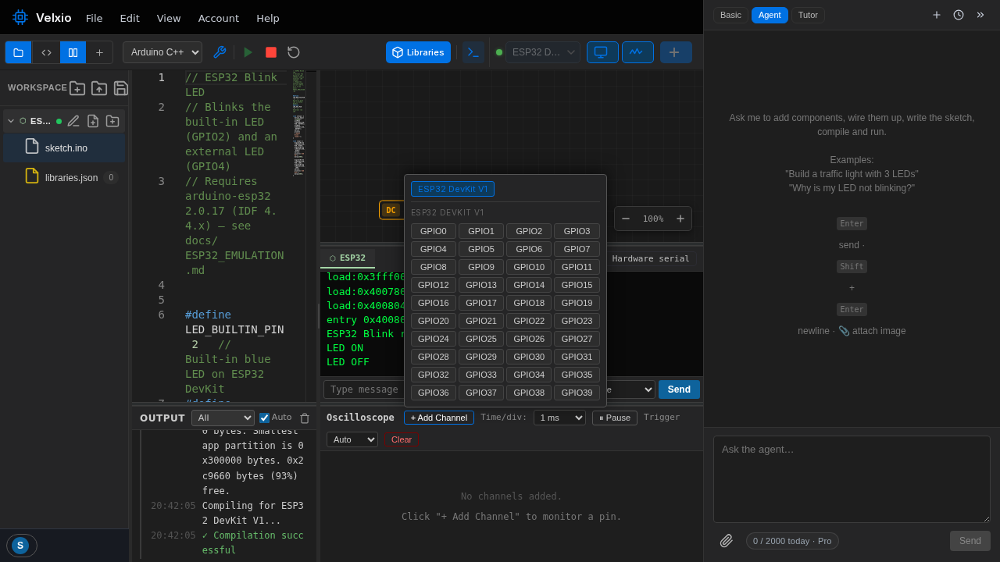
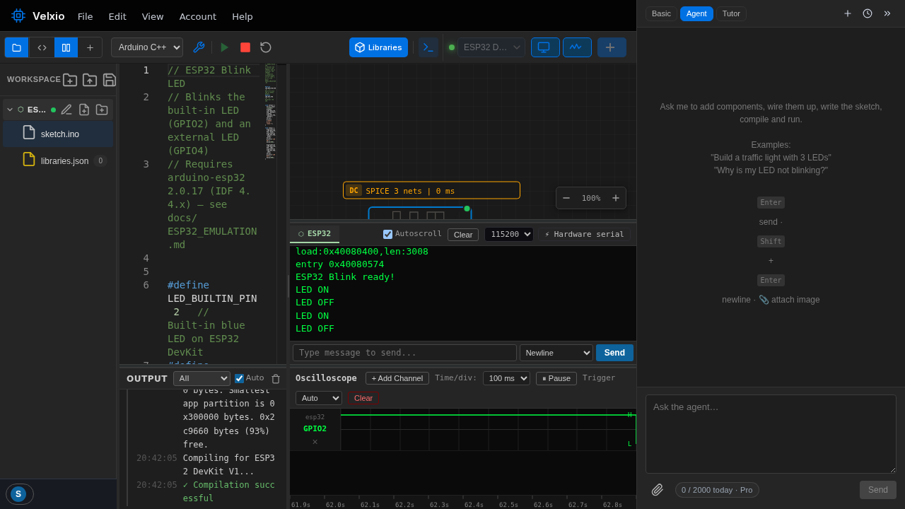

Toggle the oscilloscope with the **Scope** button in the toolbar. It opens
as a bottom panel next to the serial monitor.

## Adding a channel

Click **+ Add Channel** and pick the board pin to monitor:

Each channel gets a color and a label (board + pin). Remove one with the
small **x** under its label.

## Reading the trace

Here the scope watches **GPIO2** — the blinking LED pin of the
[first project](/docs/getting-started/first-project/):

## Controls

| Control | What it does |
| --- | --- |
| **Time/div** | Horizontal scale, from 0.1 ms to 500 ms per division. Match it to your signal: a 1 s blink reads best around 100 ms/div; a 1 kHz PWM around 0.5 ms/div. |
| **Trigger** | **Auto** (free-running), **Normal** (only draws on trigger) or **Single** (one capture). Pick the trigger channel and edge — rising, falling or either. |
| **Pause / Resume** | Freeze the display to inspect a waveform. |
| **Clear** | Wipe the traces. |

## What to try

- **Measure a PWM duty cycle**: run an `analogWrite()` sketch, watch the
  pin at 0.5 ms/div, compare high vs low time.
- **Catch a one-shot event**: set trigger to **Single**, rising edge, then
  press a button in your circuit.
- **Compare two signals**: add two channels — e.g. an encoder's A and B
  outputs — and watch their phase relationship.
