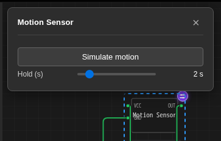

L'array `controls` in `chip.json` descrive ciò che il pannello mostra durante
l'esecuzione della simulazione. Ogni voce pilota l'attributo il cui `name`
corrisponde all'`id` della voce.

## Campi della voce

| Campo | Si applica a | Significato |
| --- | --- | --- |
| `id` | tutti | **Obbligatorio.** L'attributo pilotato da questo controllo. Una voce senza `id` viene saltata |
| `type` | tutti | `"range"` per uno slider, `"button"` per un trigger momentaneo. Qualsiasi altro valore viene ignorato e la voce non produce nulla |
| `label` | tutti | Testo accanto al controllo. Ricade sul `label` dell'attributo, poi su `id` |
| `min` | range | Limite inferiore. Ricade sul `min` dell'attributo, poi su `0` |
| `max` | range | Limite superiore. Ricade sul `max` dell'attributo, poi su `100` |
| `step` | range | Incremento. Ricade sul `step` dell'attributo, poi su `1` quando l'intervallo è più ampio di 20, altrimenti `0.01` |
| `unit` | range | Stampato dopo il valore, ad esempio `ppm` o `%`. Vuoto per impostazione predefinita |
| `scale` | range | `"log"` fornisce uno slider logaritmico. Ignorato quando `min` è negativo, poiché la curva non è definita in quel punto |

La **posizione iniziale** di uno slider non viene presa dal controllo. Proviene
dal `default` dell'attributo, con fallback su `min`. Mantieni il `default`
dell'attributo all'interno dell'intervallo del controllo, altrimenti il pannello
si apre con la maniglia bloccata a un'estremità.

## Il titolo del pannello

Deriva dal `name` del chip. Un chip senza `name` mostra "Custom Chip".

## Il fallback automatico

Non devi affatto scrivere `controls`.

**Qualsiasi attributo che dichiara sia `min` che `max`, e che nessun controllo
esplicito rivendica già, riceve uno slider.** La sua etichetta deriva dal
`label` dell'attributo, il suo step dal `step` dell'attributo, oppure viene
dedotto: `1` per `type: "int"`, altrimenti `1` quando l'intervallo è più ampio
di 20 e `0.01` quando non lo è. Non riceve alcuna unità.

Quindi `controls` serve solo per rinominare uno slider, aggiungere un'unità,
renderlo logaritmico o dichiarare un pulsante. Due conseguenze pratiche:

- I chip scritti prima dell'esistenza dei controlli live sono spesso già
  regolabili, senza alcuna modifica.
- Un chip i cui attributi non hanno `min`/`max` e nessuna sezione `controls`
  non mostra **alcun pannello**. Questo è il motivo usuale per cui cliccare
  su un chip sembra non fare nulla.

## Pulsanti

Una voce `"button"` genera un trigger momentaneo per linee di reset, eventi
stile "simula movimento" e qualsiasi altra cosa che sia un fronte piuttosto
che un livello:

 Premendolo, l'attributo viene portato a `1` e poi di nuovo a `0` circa
150 ms dopo, quindi il tuo chip dovrebbe trattare una lettura non zero come
"l'evento è accaduto" piuttosto che cercare di catturare un istante specifico.

## Dove vengono memorizzati i valori

Le posizioni degli slider vengono rispecchiate nelle proprietà salvate del
componente (sotto `attrs`) circa 250 ms dopo che smetti di spostarli, con i
valori in sospeso uniti. Ecco perché trascinare uno slider non scrive sul
progetto a ogni pixel, e perché la posizione sopravvive comunque a un salvataggio
e a un ricaricamento.

Il rispecchiamento è una *copia*. Il valore che il chip in esecuzione legge è
quello live, applicato nel momento in cui il controllo si muove.

## Motori

| Motore | Come arriva il valore |
| --- | --- |
| AVR, RP2040, ESP32 nel browser | Scritto direttamente nell'archivio attributi che WebAssembly legge a ogni `vx_attr_read` |
| ESP32 sul backend QEMU | Inoltrato al worker e applicato lì all'archivio attributi del runtime del chip |

Entrambi sono live: nessuna ricompilazione, nessun riavvio, nessun pulsante
"Applica". L'unica latenza è la frequenza con cui il tuo codice chiama
`vx_attr_read`.

## Piani

I controlli live sono **gratuiti**, su ogni piano, così come scrivere, compilare
ed eseguire il chip che li dichiara. Due funzionalità vicine sono a pagamento:
far scrivere all'AI un chip o un sensore per te (Maker e superiori), e la
libreria [My Chips](/docs/it/custom-chips/my-chips/) che mantiene un chip sul
server per il riutilizzo tra progetti (Pro).

## Quando un controllo non fa nulla

| Sintomo | Causa |
| --- | --- |
| Cliccando sul chip non si apre alcun pannello | Nessuna voce `controls` e nessun attributo con sia `min` che `max`, oppure la simulazione è ferma |
| Una voce specifica manca dal pannello | Il suo `type` non è né `range` né `button`, oppure non ha `id` |
| Lo slider si muove ma nulla cambia | Il chip ha memorizzato nella cache `vx_attr_read` invece di chiamarlo dove il valore viene usato |
| Lo slider parte dall'estremità sbagliata | Il `default` dell'attributo è fuori dall'intervallo `min`/`max` del controllo |
| Il valore salta in numeri interi | `step` è stato dedotto come `1` perché l'intervallo è più ampio di 20; imposta `step` esplicitamente |
| Uno slider logaritmico è lineare | `scale: "log"` viene ignorato quando `min` è negativo |

## Vedi anche

- [Tutorial: un sensore CO2 analogico](/docs/it/custom-chips/programmable-sensors/co2-analog/)
- [Tutorial: temperatura e umidità su I2C](/docs/it/custom-chips/programmable-sensors/i2c-env/)
- [Riferimento API per chip personalizzati](/docs/it/custom-chips/api/)
- Esempi funzionanti di ogni campo qui: il
  [pulsante](https://velxio.dev/example/motion-sensor-sim-button), lo
  [slider logaritmico](https://velxio.dev/example/night-light-log-slider), un
  sensore [SPI](https://velxio.dev/example/spi-thermometer-live-slider) e un
  sensore [UART](https://velxio.dev/example/uart-air-sensor-live-slider)
```
