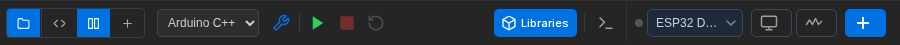
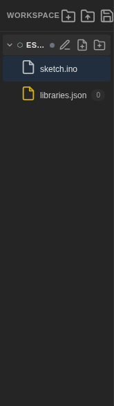
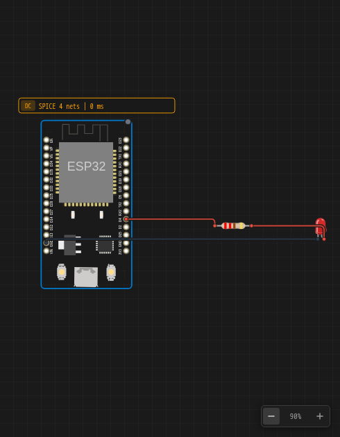
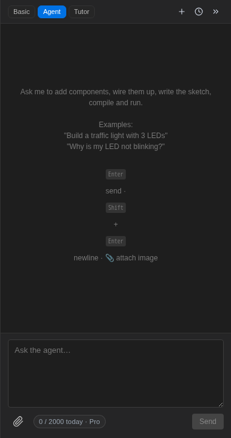

Questo è l'editor Velxio con un progetto in esecuzione:

## La barra dei menu

**File · Edit · View · Account · Help** — operazioni sul progetto, annulla/ripeti,
visibilità dei pannelli, account e piano, e risorse di aiuto.

## La barra degli strumenti

Da sinistra a destra:

| Controllo              | Cosa fa                                                                                               |
| ---------------------- | ----------------------------------------------------------------------------------------------------- |
| Toggle di layout       | Mostra l'editor **Code**, il canvas **Circuit**, o **Both** affiancati                                |
| Selettore linguaggio   | **Arduino C++**, **MicroPython** o **ESP-IDF** — per scheda, vedi [Linguaggi](/docs/it/programming/languages/) |
| **Compile** (Ctrl+B)   | Compila senza eseguire                                                                                |
| **Run**                | Compila se necessario, poi avvia la simulazione                                                       |
| **Stop** / **Reset**   | Interrompe la simulazione / riavvia il firmware dall'inizio                                           |
| **Libraries**          | Cerca e installa librerie Arduino                                                                     |
| Toggle output          | Mostra/nascondi la console di output del compilatore                                                  |
| Selettore scheda       | A quale scheda si applicano l'editor di codice e **Run** (i progetti possono averne diverse)          |
| **Serial**             | Attiva/disattiva il [monitor seriale](/docs/it/programming/serial-monitor/)                              |
| **Scope**              | Attiva/disattiva l'[oscilloscopio / analizzatore logico](/docs/it/instruments/oscilloscope/)             |
| **Add**                | Apre il [selettore componenti](/docs/it/circuit-editor/placing-components/)                              |

## Il pannello dell'area di lavoro (a sinistra)

L'albero dei file del tuo progetto: ogni scheda ha i propri file (`sketch.ino`,
`libraries.json`, qualsiasi cosa tu aggiunga). Le icone sopra creano una nuova
area di lavoro da un [modello iniziale](/docs/it/getting-started/projects/), aprono
un file di progetto e salvano.

## Il canvas (al centro)

Dove vive il circuito. Scorri per spostarti, usa i controlli di zoom in basso
a destra, clicca sui componenti per selezionarli, clicca con il tasto destro per il loro
[inspector](/docs/it/circuit-editor/part-inspector/). Il badge giallo **SPICE**
riporta lo stato del motore analogico per il circuito selezionato.

## Le console (in basso)

- **Output** — messaggi del compilatore e di sistema.
- **Serial monitor** — una scheda per ogni scheda in esecuzione; casella di input per inviare dati
  indietro. Vedi [Monitor seriale](/docs/it/programming/serial-monitor/).
- **Oscilloscopio** — quando attivato. Vedi
  [Oscilloscopio](/docs/it/instruments/oscilloscope/).

## Il pannello AI (a destra)

L'assistente nelle sue tre modalità — **Basic**, **Agent**, **Tutor** — con
la tua quota giornaliera rimanente in basso. Vedi
[Assistente AI](/docs/it/ai/overview/). Riduci a icona con il pulsante freccia quando
vuoi il canvas completo.
