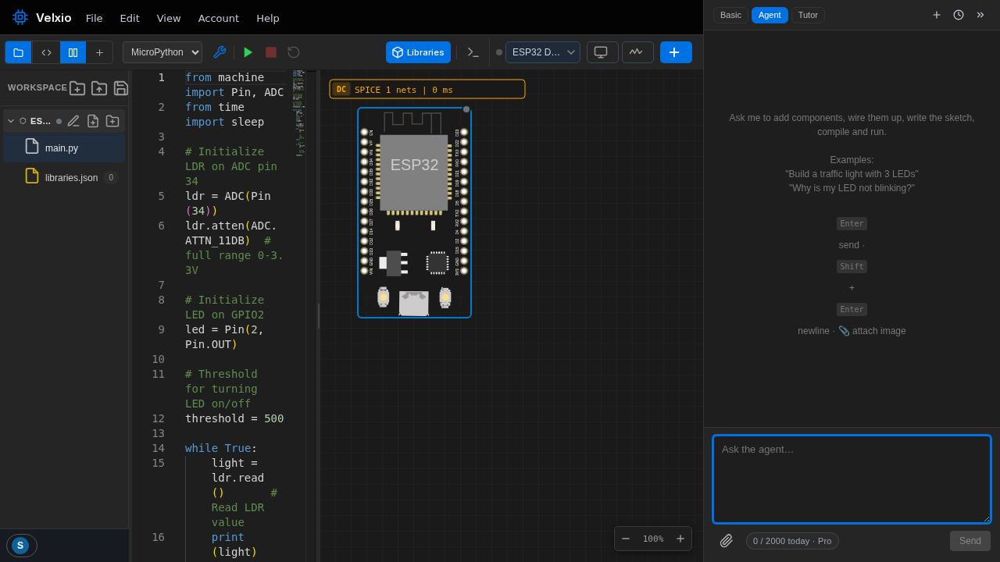
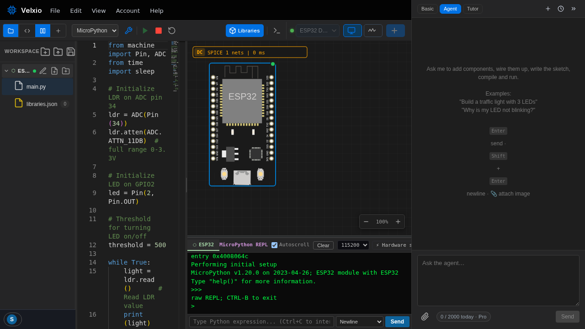

Velxio non approssima MicroPython — avvia il **firmware MicroPython reale**
sul chip emulato. `import machine` si comporta come sull'hardware,
e il [monitor seriale](/docs/it/programming/serial-monitor/)
funziona anche come REPL.

## Provalo con un clic

Apri l'esempio night-light dalla galleria — un LDR (fotoresistore)
che controlla un LED, in puro MicroPython:



Nota la barra degli strumenti: il selettore della lingua indica **MicroPython** e l'albero
dei file mostra `main.py` invece di uno sketch. Premi **Run** (Esegui):



Mentre è in esecuzione, clicca sul **fotoresistore** e trascina il suo livello di luce — la
lettura dell'ADC cambia e il LED si accende/spegne esattamente come deciso dal codice.

## Le basi

```python
from machine import Pin, ADC
import time

led = Pin(4, Pin.OUT)
ldr = ADC(Pin(34))

while True:
    if ldr.read() < 1000:   # dark
        led.on()
    else:
        led.off()
    time.sleep_ms(200)
```

- **`machine.Pin` / `ADC` / `PWM` / `I2C` / `SPI`** — controlla le stesse
  periferiche simulate usate dagli sketch Arduino.
- **Il REPL** — ferma il tuo script e scrivi Python in modo interattivo nel
  monitor seriale; `help()` funziona, anche il completamento con tab.
- **WiFi** — sulle schede ESP32, `network.WLAN` si connette a `Velxio-GUEST` come
  sull'hardware: vedi [WiFi ESP32](/docs/it/wifi-iot/esp32-wifi/).
- **Moduli extra** — aggiungi file puramente Python accanto a `main.py` e importali;
  vedi [Usare le librerie](/docs/it/programming/libraries/).

## Quali schede

MicroPython è disponibile su Raspberry Pi **Pico / Pico W** (la sua casa
nativa) e su tutta la **famiglia ESP32** — la matrice completa è in
[Linguaggi](/docs/it/programming/languages/). Passa qualsiasi scheda supportata a
MicroPython con il selettore della lingua nella barra degli strumenti; Velxio
scambia il set di file per te.
