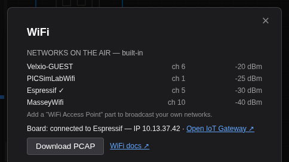

Le schede ESP32 in Velxio hanno **WiFi funzionante**. La radio emulata esegue la scansione,
si associa, ottiene un indirizzo IP tramite DHCP e raggiunge internet attraverso il
gateway NAT dell'emulatore. È il vero stack WiFi dell'SDK del fornitore che gira
su una radio emulata, non uno stub: lo stesso sketch, invariato, gira sul
chip fisico.

Questa pagina va dalla prima connessione alle tue reti, alle catture di pacchetti
e alla tua LAN reale.

## La tua prima connessione

1. Apri l'esempio della galleria **Connect to WiFi**
   ([`/example/esp32-wifi-connect`](/example/esp32-wifi-connect)), oppure trascina
   una scheda ESP32 sulla tela e incolla lo sketch qui sotto.
2. Premi **Run**. La prima compilazione di una sessione richiede più tempo; le successive sono
   memorizzate nella cache.
3. Apri il monitor **Serial** dalla barra degli strumenti sotto la tela.
4. Osserva la connessione: il chatter di avvio dell'SDK, poi la concessione DHCP.

```cpp
#include <WiFi.h>

const char* WIFI_SSID = "Velxio-GUEST";  // integrata, rete aperta

void setup() {
  Serial.begin(115200);

  WiFi.mode(WIFI_STA);
  WiFi.begin(WIFI_SSID);

  Serial.print("Connecting");
  while (WiFi.status() != WL_CONNECTED) {
    delay(250);
    Serial.print(".");
  }

  Serial.printf("\nConnected. IP: %s\n", WiFi.localIP().toString().c_str());
  Serial.printf("Gateway:      %s\n", WiFi.gatewayIP().toString().c_str());
  Serial.printf("RSSI:         %d dBm\n", WiFi.RSSI());
}

void loop() {}
```

Il monitor seriale mostra la connessione e l'indirizzo assegnato dal server DHCP emulato:


Una cosa sorprende tutti la prima volta: il log dice
`Connecting to Espressif` anche se lo sketch nomina `Velxio-GUEST`. Questo
è il lavoro di riscrittura dell'SSID, e la prossima sezione lo spiega.

L'IP è reale all'interno della simulazione: socket, client HTTP e librerie
MQTT funzionano da qui in poi. Vedi [MQTT e HTTP](/docs/it/wifi-iot/mqtt-http/)
per progetti completi.

## Le reti integrate

Senza alcuna parte di access point sulla tela, la radio emette beacon per quattro reti
demo. Una stazione si associa esattamente a una di esse:

| SSID            | Canale | Segnale | Autenticazione |
| --------------- | ------- | ------- | --------- |
| `Velxio-GUEST`  | 6       | -20 dBm | Aperta      |
| `PICSimLabWifi` | 1       | -25 dBm | WPA2-PSK  |
| `Espressif`     | 5       | -30 dBm | WPA2-PSK  |
| `MasseyWifi`    | 10      | -40 dBm | WPA2-PSK  |

### L'SSID nel tuo sketch non ha importanza

Finché il progetto non ha una parte di access point, il nome di rete che scrivi
**non** è quello a cui la scheda si associa. Durante il percorso verso l'emulatore, il compilatore
riscrive ogni letterale SSID in `Espressif` e azzera ogni letterale di password,
che sia una variabile, un array, un `#define` o un campo di struct:

```cpp
const char* ssid = "MyHomeNetwork";   // compilato come "Espressif"
#define WIFI_PASS "hunter2"           // compilato come ""
```

Ecco perché uno sketch copiato da qualsiasi tutorial si connette qui senza essere
modificato, perché l'inserimento di una password sbagliata non fallisce mai, e perché il log seriale
nomina una rete che non hai digitato. Non c'è nulla di sbagliato quando succede.

Due conseguenze che vale la pena conoscere:

- **L'aggiunta di una parte di access point disattiva la riscrittura.** Da quel momento in poi il
  progetto definisce il proprio spazio aereo, quindi ciò che digiti è ciò che esiste e
  l'SSID deve corrispondere a una parte.
- **Il firmware che arriva già compilato non passa mai attraverso la riscrittura.**
  Cerca l'SSID incorporato nel binario, motivo per cui un `.bin` altrimenti
  funzionante può rimanere lì senza riuscire ad associarsi. Ricompilalo
  nominando una delle quattro reti sopra, oppure trasmetti l'SSID che si aspetta
  con una parte di access point.

## MicroPython

```python
import network
import time

WIFI_SSID = "Velxio-GUEST"

sta = network.WLAN(network.STA_IF)
sta.active(True)
sta.connect(WIFI_SSID)

while not sta.isconnected():
    time.sleep(0.25)

print("Connected. ifconfig:", sta.ifconfig())
```

`sta.scan()` restituisce le stesse reti che vede l'API Arduino, come
tuple `(ssid, bssid, channel, rssi, authmode, hidden)`.

## Le tue reti

Con un piano Maker non sei limitato alle reti demo. Una parte **WiFi Access
Point** fa sì che la radio emulata trasmetta **il tuo** SSID.

1. Fai clic su **Add Component** nella barra degli strumenti della tela.
2. Cerca `WiFi Access Point` e posizionalo. Non richiede cablaggio: non ha
   pin, è spazio aereo.
3. Seleziona la parte e imposta **ssid** sulla rete che desideri, ad esempio
   `HomeNet`.
4. Punta lo sketch su quel nome e premi **Run**.

```cpp
WiFi.begin("HomeNet");   // l'SSID sulla tua parte Access Point
```


**Non appena un progetto contiene una parte di access point, le reti integrate
tacciono.** Una scansione vede quindi esattamente ciò che la tela definisce, il che
rende testabile il codice di selezione della rete.

### Proprietà della parte

| Proprietà   | Predefinito | Cosa fa                                                                           |
| ---------- | ----------- | -------------------------------------------------------------------------------------- |
| `ssid`     | `MyNetwork` | Il nome della rete a cui il tuo sketch si connette.                                                |
| `password` | vuota       | Memorizzata e mostrata sulla scheda. La rete trasmette comunque autenticazione aperta finché WPA2 non arriva, quindi gli sketch che passano una password si connettono comunque. |
| `channel`  | `6`         | Canale WiFi, da 1 a 13. Riportato dalle scansioni.                                                |
| `rssi`     | `-50`       | Intensità del segnale in dBm come la vede la scheda, da -90 a -20. Le scansioni ripetute variano di qualche dB come quelle reali. |
| `internet` | attivo          | Spento rende la rete isolata: la scheda si associa e ottiene un IP, ma nulla viene instradato all'esterno. |
| `bssid`    | vuota       | Indirizzo MAC dell'AP. Vuoto significa uno stabile generato dall'SSID.                        |

Provalo con un clic: **Connect to your own WiFi network**
([`/example/esp32-custom-wifi-ap`](/example/esp32-custom-wifi-ap)) si apre con
la parte già posizionata. Eseguendolo, esegue la scansione, trova esattamente la tua rete, e
si unisce ad essa:


### Più reti contemporaneamente

Aggiungi una parte per rete per testare un selettore o una politica "prima la più forte".
Ognuna ha il proprio canale e segnale, quindi una scansione restituisce un ordine come
farebbe una reale:

```cpp
int n = WiFi.scanNetworks();
for (int i = 0; i < n; i++) {
  Serial.printf("%2d: %-16s ch %2d  %d dBm\n",
                i + 1, WiFi.SSID(i).c_str(), WiFi.channel(i), WiFi.RSSI(i));
}
```

**Scan several WiFi networks**
([`/example/esp32-wifi-scan-multi`](/example/esp32-wifi-scan-multi)) include
tre parti: `HomeNet` a -40 dBm, `Office_5G` a -62 dBm e `CoffeeShop` a
-78 dBm.

### Portali captive e provisioning

Disattiva **internet** su una parte e la rete diventa isolata. La scheda
si associa e ottiene una concessione DHCP, ma nessun traffico esce. Questo è lo
scenario di provisioning: il dispositivo si avvia, non trova via d'uscita e serve la sua
pagina di configurazione.

**Captive portal on an isolated network**
([`/example/esp32-wifi-captive-portal`](/example/esp32-wifi-captive-portal))
configura questo scenario con un AP chiamato `SetupAP`.

## Il pannello WiFi

Un badge WiFi appare sulla barra degli strumenti della tela **quando premi Run**, e scompare
con Stop: appartiene alla simulazione in esecuzione, quindi non c'è nulla da aprire
prima di avviarne una. È grigio mentre lo stack si avvia e verde una volta che la
scheda ha un indirizzo.

Il badge è un pulsante diviso. L'icona mantiene la sua azione con un clic: con un IP,
apre il server web della scheda tramite il gateway IoT. Il cursore accanto
apre il **pannello WiFi**:


Il pannello mostra:

- **Reti in onda**, con canale e segnale. Il titolo dice
  *questo progetto* quando le parti di access point le definiscono, e *integrato* quando le
  quattro reti demo sono in onda:

  

- lo stato di associazione della scheda e il suo IP una volta completato il DHCP;
- **Download PCAP**, il traffico 802.11 dell'esecuzione come file di cattura;
- la sezione [gateway di rete locale](/docs/it/wifi-iot/local-gateway/). Con un
  piano Maker contiene il campo di associazione; con il piano gratuito spiega cosa
  fa il gateway e collega ai piani.

### Cattura il traffico e aprilo in Wireshark

1. Premi **Run** e lascia che lo sketch faccia il suo lavoro di rete.
2. Apri il pannello WiFi e fai clic su **Download PCAP**.
3. Apri il file in Wireshark.

La cattura contiene frame di gestione, DHCP, DNS e TCP, con timestamp
simulati, quindi `dhcp` o `dns` come filtro di visualizzazione isola la handshake che stai
eseguendo il debug. Il file viene prodotto nel tuo browser: nulla viene caricato.

## Raggiungere la tua macchina

Le reti sopra instradano verso internet pubblico. Per raggiungere il broker MQTT,
Home Assistant o il server di sviluppo in esecuzione sulla **tua** macchina, esegui il
gateway locale: vedi [Gateway di rete locale](/docs/it/wifi-iot/local-gateway/). Gli sketch
raggiungono quindi la tua macchina come `host.velxio.internal`.

## Esempi già pronti

| Esempio                                                                      | Cosa mostra                                     |
| ---------------------------------------------------------------------------- | ------------------------------------------------- |
| [Connect to WiFi](/example/esp32-wifi-connect)                               | La connessione minima a una rete integrata            |
| [Scan WiFi networks](/example/esp32-wifi-scan)                               | `scanNetworks()` contro il set integrato         |
| [Connect to your own WiFi network](/example/esp32-custom-wifi-ap)            | Una parte di access point, scansione e connessione              |
| [Scan several WiFi networks](/example/esp32-wifi-scan-multi)                 | Tre reti con canali e segnale diversi |
| [Captive portal on an isolated network](/example/esp32-wifi-captive-portal)  | `internet` spento, flusso di provisioning                 |
| [NTP clock over your WiFi](/example/esp32-wifi-ntp-clock)                    | UDP verso un server dell'ora reale                     |
| [Fetch JSON from a web API](/example/esp32-wifi-http-json)                   | HTTPClient contro una REST API reale                |
| [Reach a service on your own network](/example/esp32-wifi-local-http)        | `host.velxio.internal` tramite il gateway locale  |
| [MQTT](/example/esp32-wifi-mqtt)                                             | Pubblica e sottoscrivi su un broker pubblico          |

## Risoluzione dei problemi

| Sintomo                                            | Causa                                                                     | Soluzione                                                                        |
| -------------------------------------------------- | ------------------------------------------------------------------------- | -------------------------------------------------------------------------- |
| Il firmware caricato non si associa mai                  | Il suo SSID è incorporato, quindi il compilatore non ha potuto riscriverlo                 | Nomina una rete integrata, oppure aggiungi una parte di access point con quell'SSID         |
| Una scansione restituisce solo le tue reti                   | Funziona come previsto: una parte di access point silenzia il set integrato       | Rimuovi le parti per riavere le reti demo                              |
| Si associa e ottiene un IP, ma nulla viene instradato all'esterno   | La parte ha **internet** disattivato                                       | Attivalo, a meno che tu non stia testando un portale captive                         |
| Una password non viene respinta                    | L'emulazione WPA2 non è ancora disponibile, la rete trasmette autenticazione aperta             | Previsto per ora; la password è memorizzata sulla parte                        |
| `host.velxio.internal` non si risolve             | Nessun gateway locale associato                                                    | Vedi [Gateway di rete locale](/docs/it/wifi-iot/local-gateway/)                  |

## Quali schede

Il WiFi è disponibile in tutta la famiglia ESP32 simulata: le classiche schede
ESP32, ESP32-S3, ESP32-C3, ESP32-C6 e ESP32-C5, più le loro varianti XIAO, Nano e
M5Stack. Il Raspberry Pi Pico W ha la sua
[emulazione CYW43](/docs/it/boards/pico/). Lo stato di advertising Bluetooth viene anche
riportato per gli sketch che inizializzano BLE.
