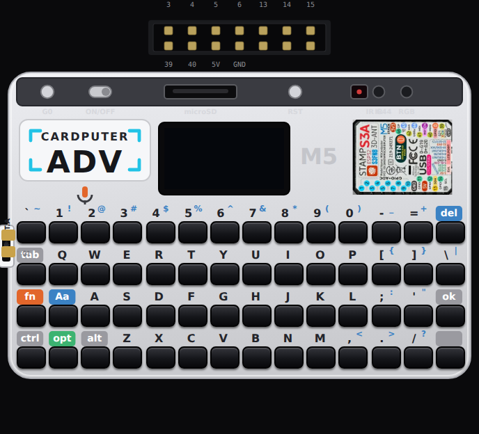
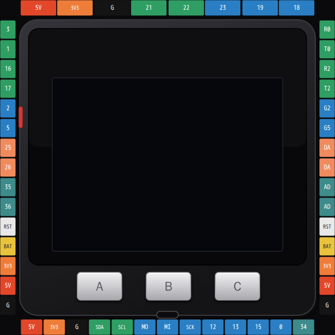
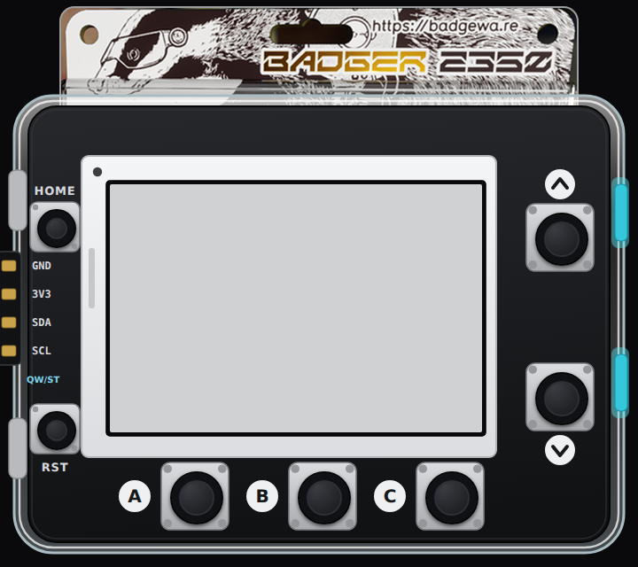
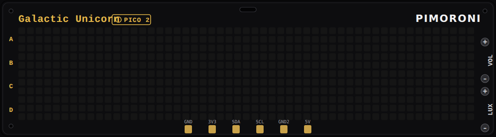
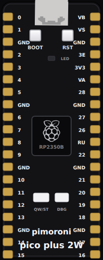
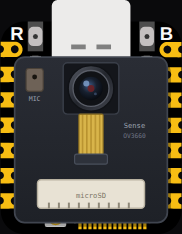
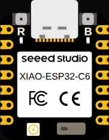
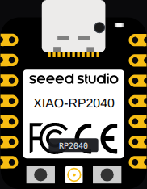
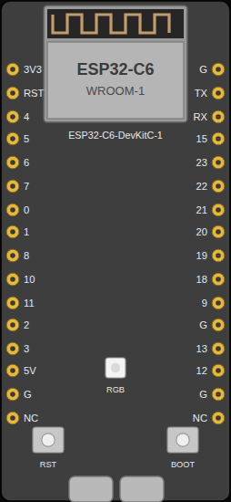
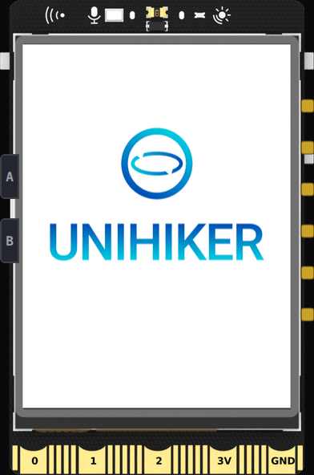

Pro ボードはカタログのプレミアム層です。豊富な内蔵ペリフェラルを備えたブランドハードウェアで、**ファクトリーファームウェア**を起動できるほど深くエミュレートされています。これらは velxio.dev のホスト型カタログの一部です。

:::note[必要なプランは？]
**有料プランが必要なのは UNIHIKER M10 のみです。** このページの他のすべてのボード — M5Stack、Pimoroni、XIAO、ESP32-C6 DevKit — は**無料プランで動作します**。有料専用ボードは、STM32 ファミリーと Raspberry Pi Linux ファミリー（UNIHIKER が属するファミリー）のみです。[プラン](/docs/ja/getting-started/plans/) を参照してください。
:::

## M5Stack

*無料プラン。*

### M5 Cardputer ADV

キーボードと TFT を備えた ESP32-S3 ポケットコンピューター。実際の M5 ランチャーファームウェアを起動します。画面上のキーボードで入力し、アプリを実行し、スピーカーを使用できます。

### M5Stack Core

320x240 TFT と 3 つのボタンを備えた、定番のスタッカブル ESP32。

## Pimoroni

*無料プラン。*

### Badger 2350

RP2350 電子ペーパーバッジ。完全な **BadgeOS ファクトリーファームウェア**を起動します。A/B/C/UP/DOWN ボタンでランチャーを操作し、時計、バッジ、ギャラリーアプリを開き、電子ペーパーが実際にそうであるようにリフレッシュされる様子を確認できます。

### Galactic Unicorn

オンボードの Pico 2 W (RP2350) によって駆動される 53x11 RGB LED マトリックス（583 ピクセル）。A/B/C/D および音量/輝度ボタンを備えています。

### Pico Plus 2 W

標準の Pico フットプリント（GP0..GP28 と電源）の Pimoroni 製 RP2350B ボード。そのため、Pico 用の配線をそのまま使用できます。GPIO、UART、USB シリアル、I2C、SPI が動作します。CYW43 WiFi コプロセッサと PSRAM はエミュレートされません。

## Seeed Studio XIAO

*無料プラン。*

### XIAO ESP32S3 Sense

カメラモジュール、PDM マイク、microSD を備えた S3。

### XIAO ESP32C6

XIAO フットプリントの WiFi 6 対応 RISC-V C6。

### XIAO RP2040

NeoPixel を備えた RP2040 XIAO。

## Espressif ESP32-C6

*無料プラン。*

**ESP32-C6 DevKit** — RISC-V WiFi 6 チップ。ESP32 ファミリーの他の製品と同じ 3 つの言語（Arduino / MicroPython / ESP-IDF）をサポートします。

## DFRobot UNIHIKER M10

*有料プランが必要です。*

タッチスクリーンを内蔵した Linux シングルボードコンピューター。完全な Linux ワークフローを共有するため、[Raspberry Pi ファミリー](/docs/ja/boards/raspberry-pi/) に記載されています。そのファミリーの他の製品と同様に、このページで**実行に有料プランが必要な唯一のボード**です。

---

Pro ボードは、[コンポーネントピッカー](/docs/ja/circuit-editor/placing-components/) に **PRO バッジ**付きで表示されます。[スターターテンプレート](/docs/ja/getting-started/projects/) には、各ボード用のすぐに実行できるプロジェクトが含まれています。

## ボードアートとピン配置

シミュレーターから生成された、各ボードのキャンバスアートと完全なピンマップ：

[Badger 2350](/docs/ja/boards/reference/badger-2350/) ·
[Galactic Unicorn](/docs/ja/boards/reference/galactic-unicorn/) ·
[Pico Plus 2 W](/docs/ja/boards/reference/pimoroni-pico-plus-2w/) ·
[M5 Cardputer ADV](/docs/ja/boards/reference/cardputer-adv/) ·
[M5Stack Core](/docs/ja/boards/reference/m5stack-core/) ·
[ESP32-C6 DevKit](/docs/ja/boards/reference/esp32-c6/) ·
[XIAO ESP32S3 Sense](/docs/ja/boards/reference/xiao-esp32s3-sense/) ·
[XIAO ESP32C6](/docs/ja/boards/reference/xiao-esp32c6/) ·
[XIAO RP2040](/docs/ja/boards/reference/xiao-rp2040/) ·
[UNIHIKER M10](/docs/ja/boards/reference/unihiker-m10/)
