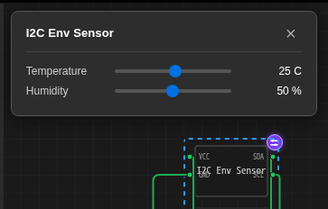

ピン上の電圧は簡単なケースです。実際のセンサーは通常プロトコルで通信し、それによって変わるのは属性を**どこで**読むかという点だけです。このチュートリアルでは、I2Cアドレス`0x44`に温度・湿度センサーを構築し、それぞれにスライダーを1つずつ用意します。

:::tip[完成した回路を開く]
[I2C環境センサー（ライブスライダー）](https://velxio.dev/example/i2c-env-sensor-live-sliders)、
下記のスケッチでUnoに配線されています。このチップは新規チップダイアログのテンプレートにもなっています。
:::

## 異なる唯一の考え方

[アナログセンサー](/docs/ja/custom-chips/programmable-sensors/co2-analog/)では、タイマーが1秒間に20回属性を再読み取りしていました。ここにはタイマーはありません。マスターがいつ読み取りを行うかを決定するため、**マスターが読み取りトランザクションを開始した瞬間に**属性をサンプリングします。それ以外の方法では、CPUを無駄に消費するか、古い値を渡すことになります。

それが`on_connect`の役割です。

## レジスタマップ

シンプルに保ちます。0.1単位の16ビット・リトルエンディアンのレジスタが2つと、自動インクリメントするポインタです:

| レジスタ | 内容 |
| --- | --- |
| `0x00` | 温度、符号付きint16、0.1℃単位 |
| `0x02` | 湿度、符号なしint16、0.1%RH単位 |

マスターは1バイト書き込んでポインタを設定し、その後読み取ります。ポインタは自動的に進むため、連続する4バイトで両方の値を取得できます。

## マニフェスト

2つの属性、2つのコントロール。各コントロールの`type: "float"`と`unit`に注目してください。これはパネルで数値の後に表示されるものです。

```json title="chip.json"
{
  "schema": "velxio-chip/v1",
  "name": "I2C Env Sensor",
  "description": "Temperature + humidity over I2C (0x44) with live sliders.",
  "pins": ["VCC", "GND", "SDA", "SCL"],
  "attributes": [
    { "name": "temperature", "label": "Temperature", "type": "float",
      "default": 25, "min": -40, "max": 85, "step": 0.5 },
    { "name": "humidity", "label": "Humidity", "type": "float",
      "default": 50, "min": 0, "max": 100, "step": 1 }
  ],
  "controls": [
    { "id": "temperature", "label": "Temperature", "type": "range",
      "min": -40, "max": 85, "step": 0.5, "unit": "C" },
    { "id": "humidity", "label": "Humidity", "type": "range",
      "min": 0, "max": 100, "step": 1, "unit": "%" }
  ]
}
```

## ソースコード

```c title="chip.c"
#include "velxio-chip.h"
#include <string.h>

#define I2C_ADDR 0x44

typedef struct {
  vx_attr temp;      /* degrees C */
  vx_attr humidity;  /* %RH */
  uint8_t reg;       /* register pointer */
  uint8_t regs[4];   /* latched at the start of a read */
} chip_state_t;

static chip_state_t S;

static void latch_registers(void) {
  /* Re-read the attributes NOW: the sliders may have moved. */
  int16_t  t = (int16_t)(vx_attr_read(S.temp) * 10.0);
  uint16_t h = (uint16_t)(vx_attr_read(S.humidity) * 10.0);
  S.regs[0] = (uint8_t)(t & 0xFF);
  S.regs[1] = (uint8_t)((t >> 8) & 0xFF);
  S.regs[2] = (uint8_t)(h & 0xFF);
  S.regs[3] = (uint8_t)((h >> 8) & 0xFF);
}

static bool on_connect(void *ud, uint8_t addr, bool is_read) {
  (void)ud; (void)addr;
  if (is_read) latch_registers();   /* sample here, not on a timer */
  return true;                      /* ACK the address */
}

static uint8_t on_read(void *ud) {
  (void)ud;
  uint8_t v = S.reg < sizeof(S.regs) ? S.regs[S.reg] : 0xFF;
  S.reg++;                          /* auto-increment */
  return v;
}

static bool on_write(void *ud, uint8_t byte) {
  (void)ud;
  S.reg = byte;                     /* a write sets the pointer */
  return true;                      /* ACK the byte */
}

static void on_stop(void *ud) { (void)ud; }

void chip_setup(void) {
  S.temp     = vx_attr_register("temperature", 25);
  S.humidity = vx_attr_register("humidity", 50);

  vx_i2c_config cfg;
  memset(&cfg, 0, sizeof(cfg));   /* zero it: unset callbacks must be NULL */
  cfg.address    = I2C_ADDR;
  cfg.scl        = vx_pin_register("SCL", VX_INPUT);
  cfg.sda        = vx_pin_register("SDA", VX_INPUT);
  cfg.on_connect = on_connect;
  cfg.on_read    = on_read;
  cfg.on_write   = on_write;
  cfg.on_stop    = on_stop;
  vx_i2c_attach(&cfg);
  vx_log("i2c env sensor at 0x44");
}
```

コピーする価値のあるポイント:

- **`memset`で設定を初期化する。** これはプレーンな構造体です。設定していないコールバックスロットに古いポインタが入っていると呼び出されてしまいます。
- **`on_connect`から`true`を返す。** そうしないとチップが自身のアドレスをNACKし、マスターはバス上に何も見えなくなります。
- **すべてのバイトではなく、読み取り時にラッチする。** `on_read`内でサンプリングすると、16ビット値の途中で温度が変化し、マスターに破れた読み取り値を渡す可能性があります。

## スケッチ

```cpp title="sketch.ino"
#include <Wire.h>

void setup() {
  Serial.begin(115200);
  Wire.begin();
}

void loop() {
  Wire.beginTransmission(0x44);
  Wire.write(0x00);                 // point at temperature
  Wire.endTransmission();

  Wire.requestFrom(0x44, 4);        // t_lo t_hi h_lo h_hi
  if (Wire.available() >= 4) {
    int16_t t  = Wire.read() | (Wire.read() << 8);
    uint16_t h = Wire.read() | (Wire.read() << 8);
    Serial.print("T="); Serial.print(t / 10.0, 1);
    Serial.print("C  RH="); Serial.print(h / 10.0, 1);
    Serial.println("%");
  }
  delay(500);
}
```

`SDA`と`SCL`をボードのI2Cピン（Unoでは`A4`と`A5`）に配線し、さらに`VCC`と`GND`も接続します。**Run**（実行）を押し、チップをクリックして、どちらかのスライダーをドラッグします。次のトランザクションで新しい値が送信されます。



## うまくいかない場合

| 表示される内容 | ほぼ確実な原因 |
| --- | --- |
| `requestFrom`が何も返さない | `on_connect`が`false`を返している、またはスケッチ内のアドレスが`cfg.address`と一致していない |
| 読み取り値がデフォルトのまま | `latch_registers`が`on_connect`ではなく`chip_setup`から呼び出されている |
| 温度が巨大な正の数として読み取られる | int16が符号なしとして拡張されている。除算の前に`int16_t`キャストを維持してください |
| 値が2つの読み取り値の間でジャンプする | サンプリングが`on_read`に移動したため、16ビット値の2つの半分が異なるスライダー位置から取得されている |
| バス上に何もない | `SDA`と`SCL`が入れ替わっている、または`VX_INPUT`以外のモードで登録されている |

## 次へ

- すべてのフィールドと自動フォールバック:
  [`controls`リファレンス](/docs/ja/custom-chips/programmable-sensors/reference/)。
- SPIおよびUARTスレーブを含む完全なC API:
  [APIリファレンス](/docs/ja/custom-chips/api/)。
