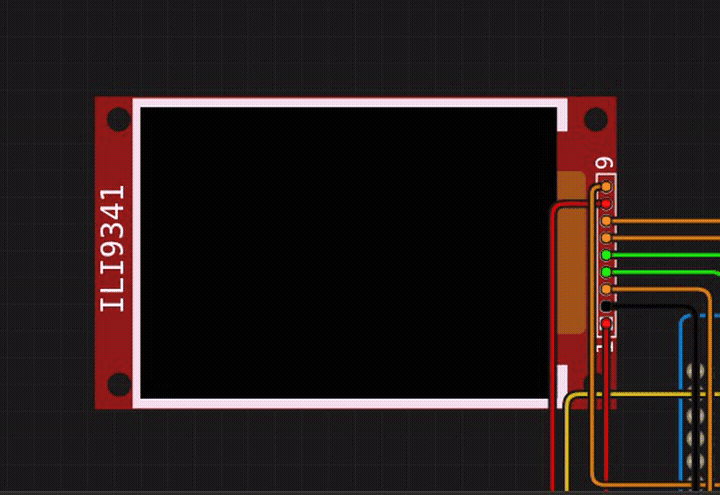
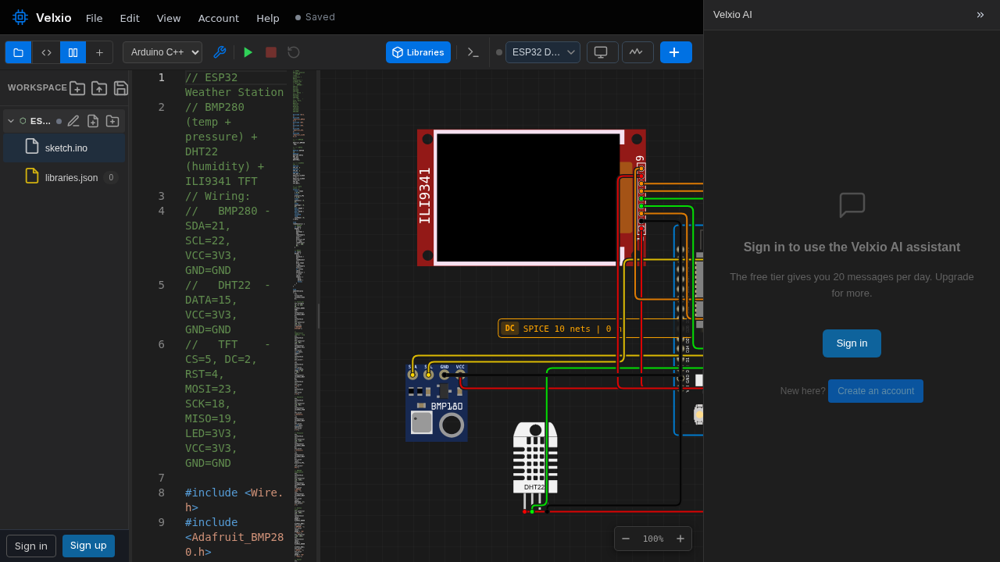
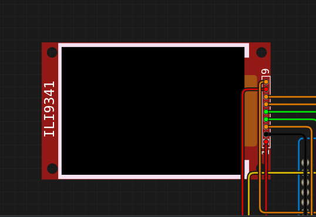
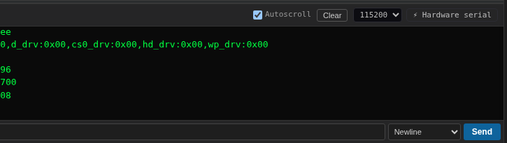

[最初のプロジェクト](/docs/ja/getting-started/first-project/)では、LEDを1つ点滅させました。
今回は実際のデバイスです。**I²C経由で温度と気圧**（BMP280）、**GPIOで湿度**（DHT22）を読み取り、**SPI経由のTFTディスプレイ**（ILI9341）にすべてを描画するESP32 — 3つのバスがブラウザ上で同時に動作します。

## 1. プロジェクトを開く

公開プロジェクトを開きます:
[velxio.dev/dave/estacin-meteorolgica-esp32](https://velxio.dev/dave/estacin-meteorolgica-esp32)。

実行する前に、回路を少し確認してみましょう:

- **BMP280** — `SDA`/`SCL`をESP32のI²Cピンに接続。2本の配線で、2つの測定値（温度 + 気圧）を取得します。
- **DHT22** — プルアップ抵抗付きのデータ用GPIOを1本使用。湿度ともう1つの温度測定値を取得します。
- **ILI9341** — SPIバンドル: `MOSI`、`SCK`、`CS`、`DC`、`RST`。任意の部品を右クリックすると、[ピン配置とデータシート](/docs/ja/circuit-editor/part-inspector/)を確認できます。

このプロジェクトは、[VelxioのAIエージェント](/docs/ja/ai/agent-mode/)によって設計、配線、プログラミングが一貫して行われました。同じものを依頼して作成することもできます。

## 2. 実行する

**Run**を押します。スケッチは実際のArduinoツールチェーンでコンパイルされ（**Output**コンソールでAdafruitライブラリの解決を確認できます）、ESP32が起動し、次のようになります:

- **TFT**はダッシュボードを描画し、ライブの測定値で更新されます。
- **シリアルモニタ**は各センサーのスイープを記録します:

## 3. 天気を変える

シミュレーション実行中に**BMP280**または**DHT22**をクリックします。センサーコントロールパネルで、温度、湿度、気圧をドラッグして変更できます。ファームウェアは次のI²C/GPIOポーリングで新しい値を読み取り、TFTがそれに追従します。このループ — 入力を調整し、デバイスの反応を確認する — が、まずシミュレーションを行うことの本質です。

## 4. 自分好みにカスタマイズ

他のプロジェクトと同様に扱えます: スケッチ内で表示レイアウトを変更したり、湿度が70%を超えたときにLEDを点灯させるしきい値を追加したり、[カタログ](/docs/ja/parts/overview/)からDHT22を別のセンサーに交換したりできます。その後、[コピーを保存](/docs/ja/getting-started/projects/)します。

## 代わりにゼロから構築する

自分で配線したい場合は: 空のESP32[テンプレート](/docs/ja/getting-started/projects/)から始め、[ピッカー](/docs/ja/circuit-editor/placing-components/)から3つの部品を追加し、上記のようにバスを配線し、**Adafruit BMP280**、**DHT sensor library**、**Adafruit ILI9341**ライブラリを追加します（[方法](/docs/ja/programming/libraries/)）。または、[AIアシスタント](/docs/ja/ai/agent-mode/)を開いて、一緒にステーションを構築するよう依頼することもできます — このプロジェクトもそうやって生まれました。

----- END PAGE -----
