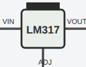

<!-- Generated by scripts/gen-parts.mjs — do not edit by hand. -->

Adjustable +1.25V to +37V linear regulator. V_out = 1.25·(1 + R2/R1). Versatile workhorse.

## Pins

| Pin      | Signals |
| -------- | ------- |
| **VIN**  | —       |
| **ADJ**  | —       |
| **VOUT** | —       |

## Use it

Add it from the [component picker](/docs/circuit-editor/placing-components/) — search for “LM317 (Adjustable Linear Regulator)” (tags: regulator, linear, lm317, adjustable, analog).
Right-click it on the canvas for the in-editor datasheet, and check the
[examples gallery](https://velxio.dev/examples) for circuits that use it.
