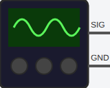

<!-- Generated by scripts/gen-parts.mjs — do not edit by hand. -->

Benchtop AC/DC signal source. Sine, square, or DC output. Configurable frequency, amplitude, DC offset.

## Pins

| Pin     | Signals |
| ------- | ------- |
| **SIG** | —       |
| **GND** | —       |

## Attributes

Editable from the [part inspector](/docs/circuit-editor/part-inspector/):

| Attribute   | Default | Description                          |
| ----------- | ------- | ------------------------------------ |
| `waveform`  | `sine`  |                                      |
| `frequency` | `1000`  | Frequency in Hz (ignored for DC)     |
| `amplitude` | `1`     | Peak amplitude in V (ignored for DC) |
| `offset`    | `0`     | DC offset in V                       |

## Use it

Add it from the [component picker](/docs/circuit-editor/placing-components/) — search for “Signal Generator” (tags: signal-generator, source, ac, dc, function-generator).
Right-click it on the canvas for the in-editor datasheet, and check the
[examples gallery](https://velxio.dev/examples) for circuits that use it.
