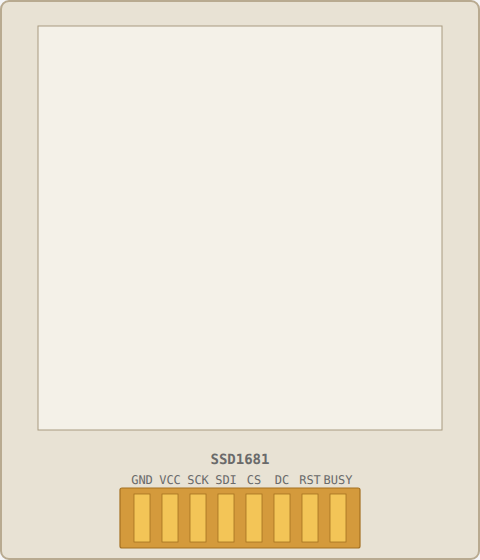

<!-- Generated by scripts/gen-parts.mjs — do not edit by hand. -->

ePaper 7.5" (800×480, B/W) — Displays part in the Velxio catalog.

## Pins

| Pin      | Signals |
| -------- | ------- |
| **GND**  | power   |
| **VCC**  | power   |
| **SCK**  | —       |
| **SDI**  | —       |
| **CS**   | —       |
| **DC**   | —       |
| **RST**  | —       |
| **BUSY** | —       |

## Attributes

Editable from the [part inspector](/docs/circuit-editor/part-inspector/):

| Attribute   | Default          | Description |
| ----------- | ---------------- | ----------- |
| `panelKind` | `epaper-7in5-bw` |             |
| `refreshMs` | `100`            |             |

## Use it

Add it from the [component picker](/docs/circuit-editor/placing-components/) — search for “ePaper 7.5" (800×480, B/W)” (tags: epaper, e-paper, e-ink, display, uc8179).
Right-click it on the canvas for the in-editor datasheet, and check the
[examples gallery](https://velxio.dev/examples) for circuits that use it.
