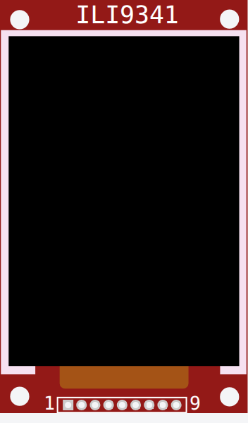

<!-- Generated by scripts/gen-parts.mjs — do not edit by hand. -->

ILI9341 — Displays part in the Velxio catalog.

## Pins

| Pin      | Signals |
| -------- | ------- |
| **VCC**  | power   |
| **GND**  | power   |
| **CS**   | spi     |
| **RST**  | —       |
| **D/C**  | —       |
| **MOSI** | spi     |
| **SCK**  | spi     |
| **LED**  | —       |
| **MISO** | spi     |

## Attributes

Editable from the [part inspector](/docs/circuit-editor/part-inspector/):

| Attribute        | Default | Description |
| ---------------- | ------- | ----------- |
| `flipHorizontal` | `false` |             |
| `flipVertical`   | `false` |             |

## Use it

Add it from the [component picker](/docs/circuit-editor/placing-components/) — search for “ILI9341” (tags: ili9341).
Right-click it on the canvas for the in-editor datasheet, and check the
[examples gallery](https://velxio.dev/examples) for circuits that use it.
