<!-- Generated by scripts/gen-parts.mjs — do not edit by hand. -->

Every part you can drop on the canvas, drawn exactly as it appears there.
Click one for its pinout, attributes and datasheet.

## Displays

|                                                                                                                                                                                                         |                                                                                                                                                                                                   |                                                                                                                                                                                                                       |                                                                                                                                                                                              |
| ------------------------------------------------------------------------------------------------------------------------------------------------------------------------------------------------------- | ------------------------------------------------------------------------------------------------------------------------------------------------------------------------------------------------- | --------------------------------------------------------------------------------------------------------------------------------------------------------------------------------------------------------------------- | -------------------------------------------------------------------------------------------------------------------------------------------------------------------------------------------- |
|  [ePaper 1.54" (200×200, B/W)](/docs/parts/displays/epaper-1in54-bw/)       |  [ePaper 2.13" (250×122, B/W)](/docs/parts/displays/epaper-2in13-bw/) |  [ePaper 2.13" (250×122, B/W/Red)](/docs/parts/displays/epaper-2in13-bwr/)          |  [ePaper 2.9" (296×128, B/W)](/docs/parts/displays/epaper-2in9-bw/) |
|  [ePaper 2.9" (296×128, B/W/Red)](/docs/parts/displays/epaper-2in9-bwr/) |  [ePaper 4.2" (400×300, B/W)](/docs/parts/displays/epaper-4in2-bw/)      |  [ePaper 5.65" (600×448, ACeP 7-colour)](/docs/parts/displays/epaper-5in65-7c/) |  [ePaper 7.5" (800×480, B/W)](/docs/parts/displays/epaper-7in5-bw/) |
|  [ILI9341](/docs/parts/displays/ili9341/)                                                                       | [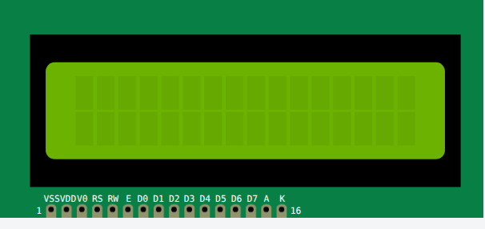](/docs/parts/displays/lcd1602-i2c/) [LCD 16x2 (I2C)](/docs/parts/displays/lcd1602-i2c/)                                       | [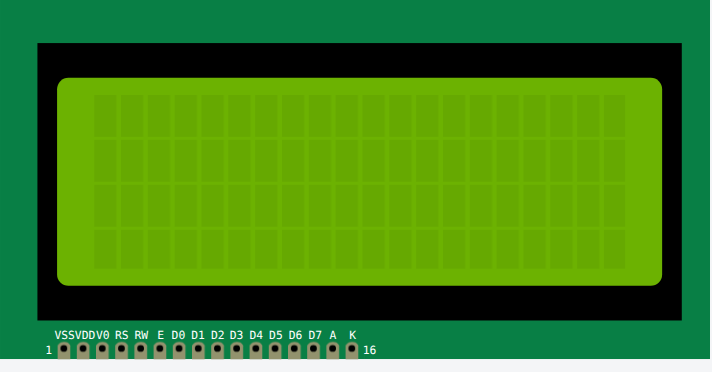](/docs/parts/displays/lcd2004-i2c/) [LCD 20x4 (I2C)](/docs/parts/displays/lcd2004-i2c/)                                                           |  [LCD1602](/docs/parts/displays/lcd1602/)                                                            |
|  [LCD2004](/docs/parts/displays/lcd2004/)                                                                       | [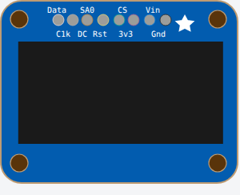](/docs/parts/displays/ssd1306/) [SSD1306 OLED](/docs/parts/displays/ssd1306/)                                                       | [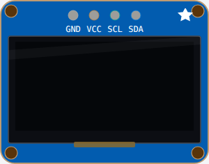](/docs/parts/displays/ssd1306-i2c-4pin/) [SSD1306 OLED (I2C, 4-pin)](/docs/parts/displays/ssd1306-i2c-4pin/)                      |                                                                                                                                                                                              |

## Sensors

|                                                                                                                                                                                   |                                                                                                                                                                                                            |                                                                                                                                                |                                                                                                                                                                                                  |
| --------------------------------------------------------------------------------------------------------------------------------------------------------------------------------- | ---------------------------------------------------------------------------------------------------------------------------------------------------------------------------------------------------------- | ---------------------------------------------------------------------------------------------------------------------------------------------- | ------------------------------------------------------------------------------------------------------------------------------------------------------------------------------------------------ |
| [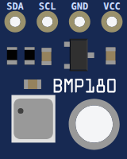](/docs/parts/sensors/bmp280/) [BMP280 (Pressure + Temp)](/docs/parts/sensors/bmp280/)                    | [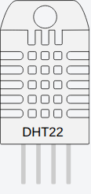](/docs/parts/sensors/dht22/) [DHT22](/docs/parts/sensors/dht22/)                                                                                      | [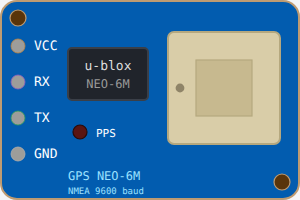](/docs/parts/sensors/gps-neo6m/) [GPS NEO-6M](/docs/parts/sensors/gps-neo6m/)    | [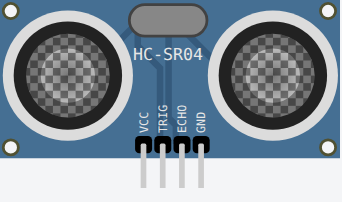](/docs/parts/sensors/hc-sr04/) [HC-SR04](/docs/parts/sensors/hc-sr04/)                                                                  |
|  [MPU6050](/docs/parts/sensors/mpu6050/)                                                   | [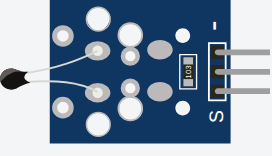](/docs/parts/sensors/ntc-temperature-sensor/) [NTC Temperature Sensor](/docs/parts/sensors/ntc-temperature-sensor/) | [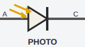](/docs/parts/sensors/photodiode/) [Photodiode](/docs/parts/sensors/photodiode/) | [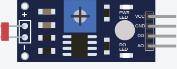](/docs/parts/sensors/photoresistor-sensor/) [Photoresistor Sensor](/docs/parts/sensors/photoresistor-sensor/) |
|  [PIR Motion Sensor](/docs/parts/sensors/pir-motion-sensor/) |                                                                                                                                                                                                            |                                                                                                                                                |                                                                                                                                                                                                  |

## Input

|                                                                                                                                                      |                                                                                                                                                      |                                                                                                                                                                     |                                                                                                                                                           |
| ---------------------------------------------------------------------------------------------------------------------------------------------------- | ---------------------------------------------------------------------------------------------------------------------------------------------------- | ------------------------------------------------------------------------------------------------------------------------------------------------------------------- | --------------------------------------------------------------------------------------------------------------------------------------------------------- |
| [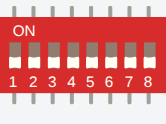](/docs/parts/input/dip-switch-8/) [DIP Switch 8](/docs/parts/input/dip-switch-8/) |  [KY-040 Rotary Encoder](/docs/parts/input/ky-040/) |  [Membrane Keypad](/docs/parts/input/membrane-keypad/) | [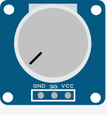](/docs/parts/input/potentiometer/) [Potentiometer](/docs/parts/input/potentiometer/) |
|  [Pushbutton](/docs/parts/input/pushbutton/)           | [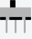](/docs/parts/input/slide-switch/) [Slide Switch](/docs/parts/input/slide-switch/) |                                                                                                                                                                     |                                                                                                                                                           |

## Output

|                                                                                                                               |                                                                                                           |                                                                                                                                                             |                                                                                                                                    |
| ----------------------------------------------------------------------------------------------------------------------------- | --------------------------------------------------------------------------------------------------------- | ----------------------------------------------------------------------------------------------------------------------------------------------------------- | ---------------------------------------------------------------------------------------------------------------------------------- |
| [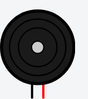](/docs/parts/output/buzzer/) [Buzzer](/docs/parts/output/buzzer/)      |  [LED](/docs/parts/output/led/) |  [Led Bar Graph](/docs/parts/output/led-bar-graph/) |  [Neopixel](/docs/parts/output/neopixel/) |
|  [RGB Led](/docs/parts/output/rgb-led/) |                                                                                                           |                                                                                                                                                             |                                                                                                                                    |

## Motors

|                                                                                                                                                   |                                                                                                                                                                       |                                                                                                                     |                                                                                                                                                             |
| ------------------------------------------------------------------------------------------------------------------------------------------------- | --------------------------------------------------------------------------------------------------------------------------------------------------------------------- | ------------------------------------------------------------------------------------------------------------------- | ----------------------------------------------------------------------------------------------------------------------------------------------------------- |
| [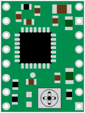](/docs/parts/motors/a4988/) [A4988 Stepper Driver](/docs/parts/motors/a4988/) | [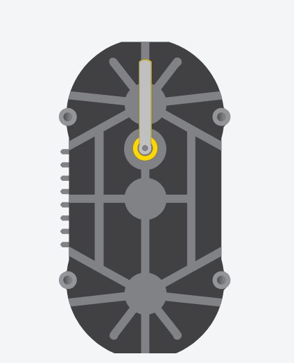](/docs/parts/motors/biaxial-stepper/) [Biaxial Stepper](/docs/parts/motors/biaxial-stepper/) |  [Servo](/docs/parts/motors/servo/) | [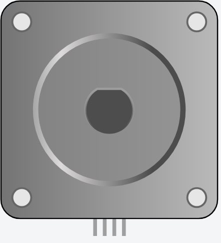](/docs/parts/motors/stepper-motor/) [Stepper Motor](/docs/parts/motors/stepper-motor/) |

## Passive

|                                                                                                                                                                                                                    |                                                                                                                                                                                |                                                                                                                                                                      |                                                                                                                                                                           |
| ------------------------------------------------------------------------------------------------------------------------------------------------------------------------------------------------------------------ | ------------------------------------------------------------------------------------------------------------------------------------------------------------------------------ | -------------------------------------------------------------------------------------------------------------------------------------------------------------------- | ------------------------------------------------------------------------------------------------------------------------------------------------------------------------- |
| [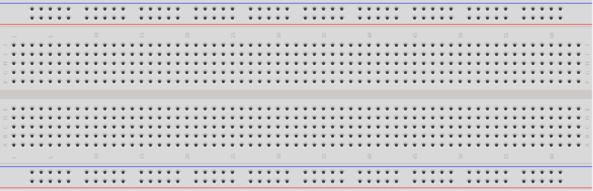](/docs/parts/passive/breadboard/) [Breadboard (full)](/docs/parts/passive/breadboard/)                                                       | [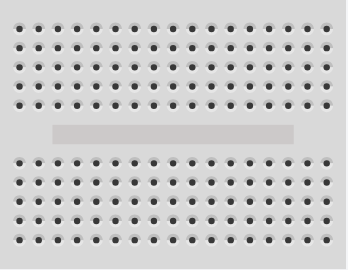](/docs/parts/passive/breadboard-mini/) [Breadboard Mini](/docs/parts/passive/breadboard-mini/)        |  [Cap. 1 nF](/docs/parts/passive/cap-1n/)                                     |  [Cap. 1 µF](/docs/parts/passive/cap-1u/)                                          |
|  [Cap. 10 nF](/docs/parts/passive/cap-10n/)                                                                              |  [Cap. 10 pF](/docs/parts/passive/cap-10p/)                                          |  [Cap. 100 nF](/docs/parts/passive/cap-100n/)                           |  [Cap. 100 pF](/docs/parts/passive/cap-100p/)                                |
|  [Cap. 22 pF](/docs/parts/passive/cap-22p/)                                                                              |  [Cap. ceramic (custom)](/docs/parts/passive/capacitor/)              |  [Electrolytic 1 µF](/docs/parts/passive/cap-elec-1u/)      |  [Electrolytic 10 µF](/docs/parts/passive/cap-elec-10u/)      |
|  [Electrolytic 100 µF](/docs/parts/passive/cap-elec-100u/)                                          |  [Electrolytic 1000 µF](/docs/parts/passive/cap-elec-1000u/) |  [Electrolytic 47 µF](/docs/parts/passive/cap-elec-47u/) |  [Electrolytic 470 µF](/docs/parts/passive/cap-elec-470u/) |
|  [Electrolytic Cap. (custom)](/docs/parts/passive/capacitor-electrolytic/) | [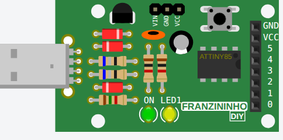](/docs/parts/passive/franzininho/) [Franzininho](/docs/parts/passive/franzininho/)                            |  [Inductor (custom)](/docs/parts/passive/inductor/)               |  [Inductor 1 mH](/docs/parts/passive/ind-1m/)                                  |
|  [Inductor 10 mH](/docs/parts/passive/ind-10m/)                                                                      |  [Inductor 100 µH](/docs/parts/passive/ind-100u/)                             | [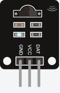](/docs/parts/passive/ir-receiver/) [IR Receiver](/docs/parts/passive/ir-receiver/)                  | [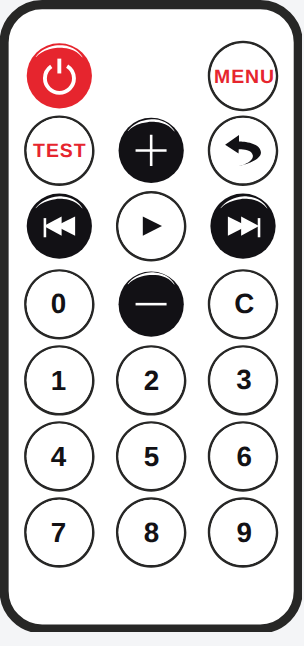](/docs/parts/passive/ir-remote/) [IR Remote](/docs/parts/passive/ir-remote/)                                 |
|  [Junction](/docs/parts/passive/junction/)                                                                               |  [Resistor (custom)](/docs/parts/passive/resistor/)                         |  [Resistor 1 kΩ](/docs/parts/passive/resistor-1k/)              |  [Resistor 1 MΩ](/docs/parts/passive/resistor-1m/)                   |
|  [Resistor 10 kΩ](/docs/parts/passive/resistor-10k/)                                                       |  [Resistor 100 kΩ](/docs/parts/passive/resistor-100k/)              |  [Resistor 2.2 kΩ](/docs/parts/passive/resistor-2k2/)       |  [Resistor 22 kΩ](/docs/parts/passive/resistor-22k/)              |
|  [Resistor 220 Ω](/docs/parts/passive/resistor-220/)                                                       |  [Resistor 330 Ω](/docs/parts/passive/resistor-330/)                   |  [Resistor 4.7 kΩ](/docs/parts/passive/resistor-4k7/)       |  [Resistor 47 kΩ](/docs/parts/passive/resistor-47k/)              |
|  [Resistor 470 Ω](/docs/parts/passive/resistor-470/)                                                       |                                                                                                                                                                                |                                                                                                                                                                      |                                                                                                                                                                           |

## Logic gates

|                                                                                                                                                                                           |                                                                                                                                                                                               |                                                                                                                                                                                               |                                                                                                                                                                                   |
| ----------------------------------------------------------------------------------------------------------------------------------------------------------------------------------------- | --------------------------------------------------------------------------------------------------------------------------------------------------------------------------------------------- | --------------------------------------------------------------------------------------------------------------------------------------------------------------------------------------------- | --------------------------------------------------------------------------------------------------------------------------------------------------------------------------------- |
|  [74HC00 (Quad 2-input NAND)](/docs/parts/logic-gates/ic-74hc00/)       | [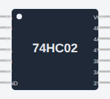](/docs/parts/logic-gates/ic-74hc02/) [74HC02 (Quad 2-input NOR)](/docs/parts/logic-gates/ic-74hc02/)             | [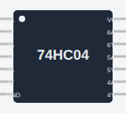](/docs/parts/logic-gates/ic-74hc04/) [74HC04 (Hex Inverter)](/docs/parts/logic-gates/ic-74hc04/)                     | [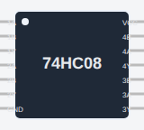](/docs/parts/logic-gates/ic-74hc08/) [74HC08 (Quad 2-input AND)](/docs/parts/logic-gates/ic-74hc08/) |
| [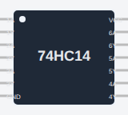](/docs/parts/logic-gates/ic-74hc14/) [74HC14 (Hex Schmitt Inverter)](/docs/parts/logic-gates/ic-74hc14/) | [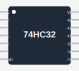](/docs/parts/logic-gates/ic-74hc32/) [74HC32 (Quad 2-input OR)](/docs/parts/logic-gates/ic-74hc32/)               | [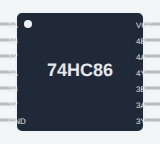](/docs/parts/logic-gates/ic-74hc86/) [74HC86 (Quad 2-input XOR)](/docs/parts/logic-gates/ic-74hc86/)             | [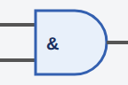](/docs/parts/logic-gates/logic-gate-and/) [AND Gate](/docs/parts/logic-gates/logic-gate-and/)                    |
| [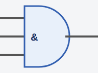](/docs/parts/logic-gates/logic-gate-and-3/) [AND Gate (3-input)](/docs/parts/logic-gates/logic-gate-and-3/)  | [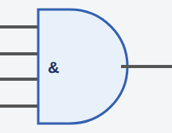](/docs/parts/logic-gates/logic-gate-and-4/) [AND Gate (4-input)](/docs/parts/logic-gates/logic-gate-and-4/)      | [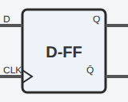](/docs/parts/logic-gates/flip-flop-d/) [D Flip-Flop](/docs/parts/logic-gates/flip-flop-d/)                                   | [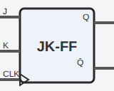](/docs/parts/logic-gates/flip-flop-jk/) [JK Flip-Flop](/docs/parts/logic-gates/flip-flop-jk/)                  |
| [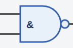](/docs/parts/logic-gates/logic-gate-nand/) [NAND Gate](/docs/parts/logic-gates/logic-gate-nand/)                       | [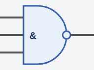](/docs/parts/logic-gates/logic-gate-nand-3/) [NAND Gate (3-input)](/docs/parts/logic-gates/logic-gate-nand-3/) | [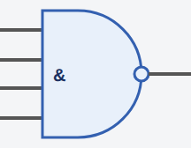](/docs/parts/logic-gates/logic-gate-nand-4/) [NAND Gate (4-input)](/docs/parts/logic-gates/logic-gate-nand-4/) | [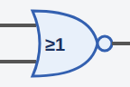](/docs/parts/logic-gates/logic-gate-nor/) [NOR Gate](/docs/parts/logic-gates/logic-gate-nor/)                    |
| [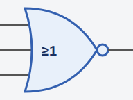](/docs/parts/logic-gates/logic-gate-nor-3/) [NOR Gate (3-input)](/docs/parts/logic-gates/logic-gate-nor-3/)  | [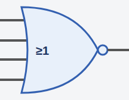](/docs/parts/logic-gates/logic-gate-nor-4/) [NOR Gate (4-input)](/docs/parts/logic-gates/logic-gate-nor-4/)      | [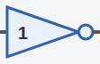](/docs/parts/logic-gates/logic-gate-not/) [NOT Gate (Inverter)](/docs/parts/logic-gates/logic-gate-not/)          | [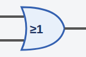](/docs/parts/logic-gates/logic-gate-or/) [OR Gate](/docs/parts/logic-gates/logic-gate-or/)                         |
| [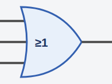](/docs/parts/logic-gates/logic-gate-or-3/) [OR Gate (3-input)](/docs/parts/logic-gates/logic-gate-or-3/)       | [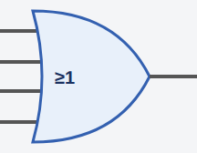](/docs/parts/logic-gates/logic-gate-or-4/) [OR Gate (4-input)](/docs/parts/logic-gates/logic-gate-or-4/)           | [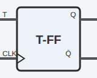](/docs/parts/logic-gates/flip-flop-t/) [T Flip-Flop](/docs/parts/logic-gates/flip-flop-t/)                                   |  [XNOR Gate](/docs/parts/logic-gates/logic-gate-xnor/)               |
| [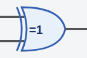](/docs/parts/logic-gates/logic-gate-xor/) [XOR Gate](/docs/parts/logic-gates/logic-gate-xor/)                            |                                                                                                                                                                                               |                                                                                                                                                                                               |                                                                                                                                                                                   |

## Analog

|                                                                                                                                                                              |                                                                                                                                                                                           |                                                                                                                                                                          |                                                                                                                                                                                             |
| ---------------------------------------------------------------------------------------------------------------------------------------------------------------------------- | ----------------------------------------------------------------------------------------------------------------------------------------------------------------------------------------- | ------------------------------------------------------------------------------------------------------------------------------------------------------------------------ | ------------------------------------------------------------------------------------------------------------------------------------------------------------------------------------------- |
| [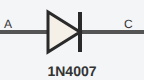](/docs/parts/analog/diode-1n4007/) [1N4007 (1 kV Rectifier)](/docs/parts/analog/diode-1n4007/) | [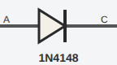](/docs/parts/analog/diode-1n4148/) [1N4148 (Small-Signal Diode)](/docs/parts/analog/diode-1n4148/)      | [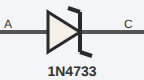](/docs/parts/analog/zener-1n4733/) [1N4733 (5.1 V Zener)](/docs/parts/analog/zener-1n4733/)   | [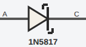](/docs/parts/analog/diode-1n5817/) [1N5817 (Schottky 20V)](/docs/parts/analog/diode-1n5817/)                    |
|  [1N5819 (Schottky 40V)](/docs/parts/analog/diode-1n5819/)     |  [2N2222 (NPN BJT)](/docs/parts/analog/bjt-2n2222/)                                  |  [2N3055 (NPN Power BJT)](/docs/parts/analog/bjt-2n3055/)     |  [2N3906 (PNP BJT)](/docs/parts/analog/bjt-2n3906/)                                    |
|  [2N7000 (N-MOSFET)](/docs/parts/analog/mosfet-2n7000/)          |  [4N25 (Optocoupler)](/docs/parts/analog/opto-4n25/)                                 |  [7805 (+5V Linear Regulator)](/docs/parts/analog/reg-7805/) |  [7812 (+12V Linear Regulator)](/docs/parts/analog/reg-7812/)                  |
|  [7905 (−5V Linear Regulator)](/docs/parts/analog/reg-7905/)     |  [9V Battery](/docs/parts/analog/battery-9v/)                                              |  [AA Battery (1.5V)](/docs/parts/analog/battery-aa/)               |  [BC547 (NPN BJT)](/docs/parts/analog/bjt-bc547/)                                         |
|  [BC557 (PNP BJT)](/docs/parts/analog/bjt-bc557/)                          |  [Coin Cell (CR2032, 3V)](/docs/parts/analog/battery-coin-cell/) |  [Diode (generic)](/docs/parts/analog/diode/)                                  |  [FQP27P06 (P-MOSFET)](/docs/parts/analog/mosfet-fqp27p06/)               |
|  [Ideal Op-Amp](/docs/parts/analog/opamp-ideal/)                          |  [IRF540 (N-MOSFET Power)](/docs/parts/analog/mosfet-irf540/)           |  [IRF9540 (P-MOSFET)](/docs/parts/analog/mosfet-irf9540/) |  [LM317 (Adjustable Linear Regulator)](/docs/parts/analog/reg-lm317/) |
|  [LM324 (Quad Op-Amp)](/docs/parts/analog/opamp-lm324/)            |  [LM358 (Dual Op-Amp)](/docs/parts/analog/opamp-lm358/)                         |  [LM741 (Op-Amp)](/docs/parts/analog/opamp-lm741/)                  |  [PC817 (Optocoupler)](/docs/parts/analog/opto-pc817/)                              |
|  [Regulated Power Supply](/docs/parts/analog/power-supply/)   |  [Signal Generator](/docs/parts/analog/signal-generator/)                |  [TL072 (JFET Op-Amp)](/docs/parts/analog/opamp-tl072/)        |                                                                                                                                                                                             |

## Electromechanical

|                                                                                                                                                                                                                                            |                                                                                                                                                         |     |     |
| ------------------------------------------------------------------------------------------------------------------------------------------------------------------------------------------------------------------------------------------ | ------------------------------------------------------------------------------------------------------------------------------------------------------- | --- | --- |
|  [L293D (Dual H-Bridge Motor Driver)](/docs/parts/electromechanical/motor-driver-l293d/) |  [Relay (SPDT)](/docs/parts/electromechanical/relay/) |     |     |

## Other

|                                                                                                                                                                                         |                                                                                                                                                                                    |                                                                                                                                                                          |                                                                                                                                                                               |
| --------------------------------------------------------------------------------------------------------------------------------------------------------------------------------------- | ---------------------------------------------------------------------------------------------------------------------------------------------------------------------------------- | ------------------------------------------------------------------------------------------------------------------------------------------------------------------------ | ----------------------------------------------------------------------------------------------------------------------------------------------------------------------------- |
|  [7 Segment](/docs/parts/other/7segment/)                                                      |  [Analog Joystick](/docs/parts/other/analog-joystick/)                |  [Big Sound Sensor](/docs/parts/other/big-sound-sensor/) |  [DS1307](/docs/parts/other/ds1307/)                                                        |
|  [DS3231 RTC](/docs/parts/other/ds3231/)                                                          |  [Flame Sensor](/docs/parts/other/flame-sensor/)                               |  [Gas Sensor](/docs/parts/other/gas-sensor/)                               |  [Heart Beat Sensor](/docs/parts/other/heart-beat-sensor/) |
|  [HX711](/docs/parts/other/hx711/)                                                                       |  [KS2E-M-DC5](/docs/parts/other/ks2e-m-dc5/)                                         |  [LED Ring](/docs/parts/other/led-ring/)                                         |  [microSD Card](/docs/parts/other/microsd-card/)                          |
|  [Nano RP2040 Connect](/docs/parts/other/nano-rp2040-connect/) |  [NeoPixel Matrix](/docs/parts/other/neopixel-matrix/)                |  [Pushbutton 6mm](/docs/parts/other/pushbutton-6mm/)           |  [Rotary Dialer](/docs/parts/other/rotary-dialer/)                     |
|  [Slide Potentiometer](/docs/parts/other/slide-potentiometer/) |  [Small Sound Sensor](/docs/parts/other/small-sound-sensor/) |  [Tilt Switch](/docs/parts/other/tilt-switch/)                          |                                                                                                                                                                               |
