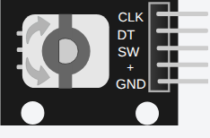

<!-- Generated by scripts/gen-parts.mjs — do not edit by hand. -->

KY-040 incremental rotary encoder with push-button. Turning the knob outputs quadrature pulses on CLK and DT (direction = which leads); the shaft press drives an active-low SW. Reads from any board's GPIO.

## Pins

| Pin     | Signals |
| ------- | ------- |
| **CLK** | —       |
| **DT**  | —       |
| **SW**  | —       |
| **VCC** | power   |
| **GND** | power   |

## Attributes

Editable from the [part inspector](/docs/circuit-editor/part-inspector/):

| Attribute  | Default | Description |
| ---------- | ------- | ----------- |
| `angle`    | `0`     |             |
| `stepSize` | `18`    |             |
| `pressed`  | `false` |             |

## Use it

Add it from the [component picker](/docs/circuit-editor/placing-components/) — search for “KY-040 Rotary Encoder” (tags: rotary, encoder, rotary encoder, rotary-encoder, ky-040).
Right-click it on the canvas for the in-editor datasheet, and check the
[examples gallery](https://velxio.dev/examples) for circuits that use it.
