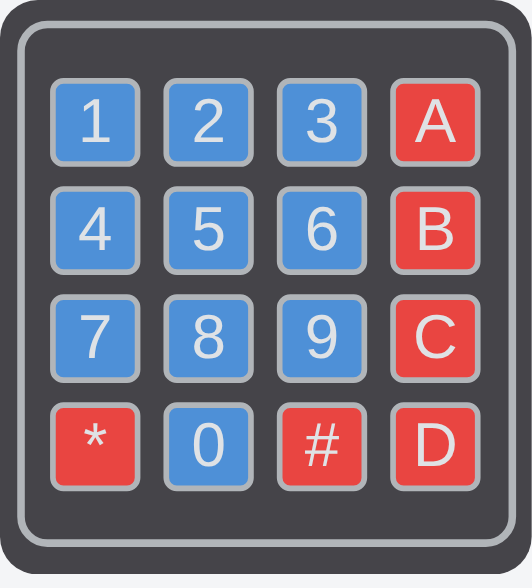

<!-- Generated by scripts/gen-parts.mjs — do not edit by hand. -->

Membrane Keypad — Input part in the Velxio catalog.

## Pins

| Pin    | Signals |
| ------ | ------- |
| **R1** | —       |
| **R2** | —       |
| **R3** | —       |
| **R4** | —       |
| **C1** | —       |
| **C2** | —       |
| **C3** | —       |
| **C4** | —       |

## Attributes

Editable from the [part inspector](/docs/circuit-editor/part-inspector/):

| Attribute   | Default                           | Description |
| ----------- | --------------------------------- | ----------- |
| `columns`   | `4`                               |             |
| `connector` | `false`                           |             |
| `keys`      | `1,2,3,A,4,5,6,B,7,8,9,C,*,0,#,D` |             |

## Use it

Add it from the [component picker](/docs/circuit-editor/placing-components/) — search for “Membrane Keypad” (tags: membrane-keypad, membrane keypad, membrane, keypad).
Right-click it on the canvas for the in-editor datasheet, and check the
[examples gallery](https://velxio.dev/examples) for circuits that use it.
