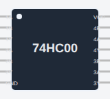

<!-- Generated by scripts/gen-parts.mjs — do not edit by hand. -->

Four 2-input NAND gates in one 14-pin DIP package. 74HC family (high-speed CMOS).

## Pins

| Pin     | Signals |
| ------- | ------- |
| **1A**  | —       |
| **1B**  | —       |
| **1Y**  | —       |
| **2A**  | —       |
| **2B**  | —       |
| **2Y**  | —       |
| **GND** | —       |
| **3Y**  | —       |
| **3A**  | —       |
| **3B**  | —       |
| **4Y**  | —       |
| **4A**  | —       |
| **4B**  | —       |
| **VCC** | —       |

## Use it

Add it from the [component picker](/docs/circuit-editor/placing-components/) — search for “74HC00 (Quad 2-input NAND)” (tags: ic, 74hc, 74hc00, nand, quad).
Right-click it on the canvas for the in-editor datasheet, and check the
[examples gallery](https://velxio.dev/examples) for circuits that use it.
