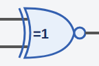

<!-- Generated by scripts/gen-parts.mjs — do not edit by hand. -->

2-input XNOR logic gate. Output Y = NOT(A ⊕ B).

## Pins

| Pin   | Signals |
| ----- | ------- |
| **A** | —       |
| **B** | —       |
| **Y** | —       |

## Use it

Add it from the [component picker](/docs/circuit-editor/placing-components/) — search for “XNOR Gate” (tags: logic, gate, xnor, digital).
Right-click it on the canvas for the in-editor datasheet, and check the
[examples gallery](https://velxio.dev/examples) for circuits that use it.
