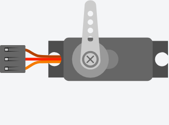

<!-- Generated by scripts/gen-parts.mjs — do not edit by hand. -->

The angle of the servo (0-180 degrees)

## Pins

| Pin     | Signals |
| ------- | ------- |
| **GND** | power   |
| **V+**  | power   |
| **PWM** | pwm     |

## Attributes

Editable from the [part inspector](/docs/circuit-editor/part-inspector/):

| Attribute   | Default  | Description |
| ----------- | -------- | ----------- |
| `angle`     | `0`      |             |
| `horn`      | `single` |             |
| `hornColor` | `#ccc`   |             |

## Use it

Add it from the [component picker](/docs/circuit-editor/placing-components/) — search for “Servo” (tags: servo).
Right-click it on the canvas for the in-editor datasheet, and check the
[examples gallery](https://velxio.dev/examples) for circuits that use it.
