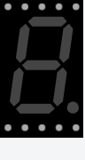

<!-- Generated by scripts/gen-parts.mjs — do not edit by hand. -->

7 Segment — Other part in the Velxio catalog.

## Pins

| Pin       | Signals |
| --------- | ------- |
| **COM.1** | —       |
| **COM.2** | —       |
| **A**     | —       |
| **B**     | —       |
| **C**     | —       |
| **D**     | —       |
| **E**     | —       |
| **F**     | —       |
| **G**     | —       |
| **DP**    | —       |

## Attributes

Editable from the [part inspector](/docs/circuit-editor/part-inspector/):

| Attribute    | Default           | Description |
| ------------ | ----------------- | ----------- |
| `color`      | `red`             |             |
| `offColor`   | `#444`            |             |
| `background` | `black`           |             |
| `digits`     | `1`               |             |
| `colon`      | `false`           |             |
| `colonValue` | `false`           |             |
| `pins`       | `top`             |             |
| `values`     | `0,0,0,0,0,0,0,0` |             |

## Use it

Add it from the [component picker](/docs/circuit-editor/placing-components/) — search for “7 Segment” (tags: 7segment, 7 segment, 7, segment).
Right-click it on the canvas for the in-editor datasheet, and check the
[examples gallery](https://velxio.dev/examples) for circuits that use it.
